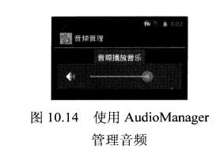

# 10.5音频管理器(AudioManager)
 　　在某些时候，程序需要管理系统音量，或者直接让系统静音，这就可借助Android提供的AudioManager来实现。程序一样是调用getSystemService()方法来获取系统的音频管理器，接下来就可调用AudioManager的方法来控制手机音频了。

## 10.5.1 AudioManager 简介
　　在程序获取了 AudioManager对象之后，接下来就可调用AudioManager的如下常用方法来控制手机音频了。  
* adjustStreamVolume(int streamType,int direction,int flages):调整手机指定类型的声音。其中第一个参数streamType指定声音类型，该参数可接受如下几个值。
* STREAM_ALARM：手机闹铃的声音。
* STREAM_DTMF:DTMF音调的声音。
* STREAM_MUSIC：手机音乐的声音。
* STREAM_NOTIFICATION：系统提示的声音。
* STREAM_RING：电话铃声的声音。
* STREAM_SYSTEM：手机系统的声音。
* SREAM_VOICE_CALL：语音电话的声音。

　　第二个参数指定对声音进行增大、还是减少；第三个参数是调整声音时的标志，例如指定FLAG_SHOW_UI，则制定调整声音时显示音量进度条。

* setMicrophoneMute（boolean on）：设置是否让麦克风静音。
* setMode(int mode):设置声音模式，可设置的值有NORNAL、RINGTONE和IN_CALL。
* setRingerMode（int ringerMode）：设置手机的电话铃声的模式。可支持如下几个属性值。
* RINGER_MODE_NORMAL：正常的手机铃声。
* RINGER_MODE_SLENT：手机铃声静音。
* RINGER_MODE_VIBRATE：手机振动。
* setSpeakerphoneOn(boolean on)：设置是否打开扩音器。
* setStreamMUte（int streamType，boolean state）：将手机的指定类型的声音调整为静音。其中streamType参数与adjustStreamVolume方法中第一个参数的意义相同。
* setStreamVolume（int streamType，int index，int flags）：直接设置手机的指定类型的音量值。其中streamType参数与adjustStreamVolume方法中第一个参数的意义相同。  

　　下面将通过一个简单的实例来示范AudioManager控制手机音频。

###实例：使用AudioManager控制手机音频
　　本程序提供一个按钮用于播放音乐，系统使用MediaPlayer播放音乐，程序还提供两个按钮控制音乐的音量的提高、降低，并使用一个ToggleButton来控制是否静音。

　　该程序的界面比较简单，只是包含几个简单的按钮即可，改程序代码如下。

　　　　**程序清单：codes\10\10.5\AudioTest\src\org\crazyit\manager\AudioTest.java**

```java
public class AudioTest extends Activity
{
	Button play, up, down;
	ToggleButton mute;
	AudioManager aManager;
	@Override
	public void onCreate(Bundle savedInstanceState)
	{
		super.onCreate(savedInstanceState);
		setContentView(R.layout.main);
		// 获取系统的音频服务
		aManager = (AudioManager) getSystemService(
				Service.AUDIO_SERVICE);
		// 获取界面中三个按钮和一个ToggleButton控件
		play = (Button) findViewById(R.id.play);
		up = (Button) findViewById(R.id.up);
		down = (Button) findViewById(R.id.down);
		mute = (ToggleButton) findViewById(R.id.mute);
		// 为play按钮的单击事件绑定监听器
		play.setOnClickListener(new OnClickListener()
		{
			@Override
			public void onClick(View source)
			{
				// 初始化MediaPlayer对象，准备播放音乐
				MediaPlayer mPlayer = MediaPlayer.create(
						MainActivity.this, R.raw.earth);
				// 设置循环播放
				mPlayer.setLooping(true);
				// 开始播放
				mPlayer.start();
			}
		});
		up.setOnClickListener(new OnClickListener()
		{
			@Override
			public void onClick(View source)
			{
				// 指定调节音乐的音频，增大音量，而且显示音量图形示意
				aManager.adjustStreamVolume(AudioManager.STREAM_MUSIC,					//标记1
						AudioManager.ADJUST_RAISE, AudioManager.FLAG_SHOW_UI);
			}
		});
		down.setOnClickListener(new OnClickListener()
		{
			@Override
			public void onClick(View source)
			{
				// 指定调节音乐的音频，降低音量，而且显示音量图形示意
				aManager.adjustStreamVolume(AudioManager.STREAM_MUSIC,             	//标记2
						AudioManager.ADJUST_LOWER, AudioManager.FLAG_SHOW_UI);
			}
		});
		mute.setOnCheckedChangeListener(new OnCheckedChangeListener()
		{
			@Override
			public void onCheckedChanged(CompoundButton source,
										 boolean isChecked)
			{
				// 指定调节音乐的音频，根据isChecked确定是否需要静音
				aManager.setStreamMute(AudioManager.STREAM_MUSIC,				//标记3
						isChecked);
			}
		});
	}
}
```
　　上面的程序中第一段标记代码使用AudioManager的adjustStreamVolume提高播放音乐的音量；第二段标记代码使用AudioManager的adjustStreamVolume降低播放音乐的音量；第三段代码则调用了AudioManager的setStreamMute()方法将音乐设置为静音。

　　运行该程序，单击程序中“增大音量”或“降低音量”按钮，系统播放音乐音量将会随之改变，如图10.14所示。
