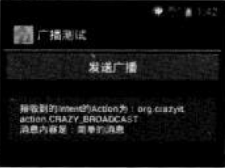
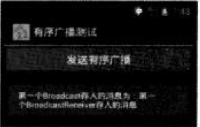

# 10.8接收广播信息

Android系统的四大组件还有一种`BroadcastReceiver`，这种组件本质上就是一种全局的监听器，用于监听系统全局的广播消息。由于`BroadcastReceiver`是一种全局的监听器，因此它可以非常方便地实现系统中不同组件之间的通信，例如我们希望客户端程序与`startService()`方法启动的	`Service`之间通信。就可以借助于`BroadcastReceiver`来实现。

## 10.8.1 BroadcastReceiver简介

`BroadcastReceiver`勇于接受程序（包括用户开发的程序和系统内建的程序）所发出的`Broadcast Intent`，与应用程序启动`Activity`、`Service`相同的是，程序启动`BroadcastReceiver`也只需要两步。

1. 创建需要启动的`BroadcastReceiver`的`Intent`。
2. 调用`Context`的`sendBroadcast()`或`sendOrderedBroadcast()`方法来启动指定的`BroadcastReceiver`。

当应用程序发出一个`Broadcast Intent`之后，所以匹配该`Intent`的`BroadcastReceiver`都有可能被启动。

与`Activity`、`Service`具有完整的生命周期不同，`BroadcastReceiver`本质上只是一个系统级的监听器——它专门负责监听各程序所发出的`Broadcast`。

由于`BroadcastReceiver`本质上属于一个监听器，因此实现`BroadcastReceiver`的方法也十分简单，只要重写`BroadcastReceiver`的`onReceive(Context context, Intent intent)`方法即可。

一旦实现了`BroadcastReceiver`，接下来就应该指定该`BroadcastReceiver`能匹配的`Intent`，此时有两种方式。
- 使用代码进行指定，调用`BroadcastReceiver`的`Context`的`RegisterReceiver(BroadcastReceiver receiver, IntentFilter filter)`方法指定，例如如下代码：
``` java
IntentFilter filter = new IntentFilter("android.provider.Telephony.SMS_RECEIVED");
IncomingSMSReceiver receiver = new IncomingSMSReceiver();
registerReceiver(receiver, filter);
```
- 在`AndroidManifest.xml`文件中配置。例如如下代码：
``` xml
<receiver android:name=".IncomingSMSReceiver">
    <intent-filter>
        <action android:name="android.provider.Telephony.SMS_RECEIVED">
    </intent-filter>
</receiver>
```

每次系统`Broadcast`事件发生后，系统就会创建对应的`BroadcastReceiver`的实例，并自动触发它的`onReceive()`方法，`onReceive()`方法执行完后，`BroadcastReceiver`的实例就会被销毁。

如果`BroadcastReceiver`的`onReceive()`方法不能在10秒内执行完成，Android会认为该程序无响应。所以不要在`BroadcastReceiver`的`onReceive()`方法里执行一些耗时的操作，否则会弹出ANR(Application No Response)的对话框。

如果确实需要根据`Broadcast`来完成一项比较耗时的操作，则可以考虑通过`Intent`启动一个`Service`来完成操作，不应考虑使用新线程去完成耗时的操作，因为`BroadcastReceiver`本身的生命周期很短，可能出现的情况是子线程可能还没有结束，`BroadcastReceiver`就已经退出了。

如果`BroadcastReceiver`所在的进程结束了，虽然该进程内还有用户启动的新线程，但由于该进程内不包含任何活动组件，因此系统可能在内存紧张时优先结束该进程。这样就可能导致`BroadcastReceiver`启动的子线程不能执行完成。

##　10.8.2 发送广播

在程序中发送广播十分简单，只要调用`Context`的`sendBroadcast(Intent intent)`方法即可。这条广播将会启动`intent`参数所对应的`BroadcastReceiver`。

下面一个简单的程序示范了如何发送`Broadcast`，使用`BroadcastReceiver`接受广播，该程序的`Activity`界面中包含一个按钮，当用户单击该按钮时程序会向外发送一条广播。该程序的代码如下。

``` java
public class MainActivity extends Activity
{
	Button send;
	@Override
	public void onCreate(Bundle savedInstanceState)
	{
		super.onCreate(savedInstanceState);
		setContentView(R.layout.main);
		// 获取程序界面中的按钮
		send = (Button) findViewById(R.id.send);
		send.setOnClickListener(new OnClickListener()
		{
			@Override
			public void onClick(View v)
			{
				// 创建Intent对象
				Intent intent = new Intent();
				// 设置Intent的Action属性
				intent.setAction("org.crazyit.action.CRAZY_BROADCAST");
				intent.putExtra("msg", "简单的消息");
				// 发送广播
				sendBroadcast(intent);
			}
		});
	}
}
```
上面的程序中粗体字代码用于创建一个`Intent`对象，并使用该`Intent`对象对外发送一条广播，该程序所使用的`BroadcastReceiver`代码如下。
``` java
public class MyReceiver extends BroadcastReceiver
{
	@Override
	public void onReceive(Context context, Intent intent)
	{
		Toast.makeText(context,
			"接收到的Intent的Action为：" + intent.getAction()
			+ "\n消息内容是：" + intent.getStringExtra("msg")
			, Toast.LENGTH_LONG).show();
	}
}
```
正如上面的程序中看到的，当符合该`MyRecevier`的广播出现时，该`MyReceiver`的`onReceiver()`方法将会被触发，从而在该方法中显示广播所携带的消息。

上面发送广播的程序中指定发送广播所用的`Intent`的`Action`为`org.crazyit.action.CRAZY_BROADCAST`,这就需要配置上面的`BroadcastReceiver`应监听`Action`为该字符串的`Intent`，在`AndroidManifest.xml`文件中增加如下配置即可：
``` java
<receiver android:name=".MyReceiver">
	<intent-filter>
		<!-- 指定该BroadcastReceiver所响应的Intent的Action -->
		<action android:name="org.crazyit.action.CRAZY_BROADCAST" />
	</intent-filter>
</receiver>
```
运行该程序，并单击程序中的`发送广播`按钮，将看到程序有如下图所示的提示。


## 10.8.3 有序广播
`Broadcast`被分为如下两种。
- `Normal Broadcast(普通广播)`：`Normal Broadcast`是完全异步的，可以在同一时刻（逻辑上）被所有接收者接收到，消息传递的效率比较高。但缺点是接受者不能将处理结果传递给下一个接受者，并且无法终止`Broadcast Intent`的传播。
- `Ordered Broadcast(有序广播)`：`Ordered Broadcast`的接受者将按预先声明的优先级依次接受`Broadcast`。如：A的级别高于B、B的级别高于C，那么，`Broadcast`先传给A，再传给B，最后传给C。优先级别声明在`<intent-filter...>`元素的`android:proority`属性中，数越大优先级别越高，取值范围为-1000~1000，优先级别也可以调用`IntentFilter`对象的`setPriority()`进行设置。`Ordered Broadcast`接受者可以终止`Broadcast intent`的传播，`Broadcast Intent`的传播一旦终止，后面的接受者就无法接收到`Broadcast`。另外，`Ordered Broadcast`的接受者可以将数据传递给下一个接受者，如：A得到`Broadcast`后，可以往他的结果对象中存入数据，当`Broadcast`传给B时，B可以从A的结果对象中得到A存入的数据。

Context提供的如下方法用于发送广播。
- `sendBroadcast()`：发送`Normal Broadcast`。
- `sendOrderedBroadcast()`：发送`Ordered Broadcast`。

对于`Ordered Broadcast`而言，系统会根据接受着声明的优先级别按顺序逐个执行接受者，优先接收到`Broadcast`的接受者可以终止`Broadcast`，调用`BroadcastReceiver`的`abortBroadcast()`方法即可终止`Broadcast`。如果`Broadcast`被前面的接受者终止，后面的接受者就再也无法获取到`Broadcast`。

不仅如此，对于`Ordered Broadcast`而言，优先接收到`Broadcast`的接收者可以通过`setResultExtras(Bundle)`方法将处理结果存入`Broadcast`中，然后传给下一个接收者，下一个接收者通过代码：`Bundle bundle = getResultExtras(true)`可以获取上一个接受者存入的数据。

接下来介绍一个发送有序广播的示例，该程序的`Activity`界面上只有一个普通按钮，该按钮用于发送一条有序广播。该程序代码如下。
``` java
public class MainActivity extends Activity
{
	Button send;
	@Override
	public void onCreate(Bundle savedInstanceState)
	{
		super.onCreate(savedInstanceState);
		setContentView(R.layout.main);
		// 获取程序中的send按钮
		send = (Button) findViewById(R.id.send);
		send.setOnClickListener(new OnClickListener()
		{
			@Override
			public void onClick(View v)
			{
				// 创建Intent对象
				Intent intent = new Intent();
				intent.setAction("org.crazyit.action.CRAZY_BROADCAST");
				intent.putExtra("msg", "简单的消息");
				// 发送有序广播
				sendOrderedBroadcast(intent, null);
			}
		});
	}
}
```
上面的程序中粗体字代码指定了`Intent`的`Action`属性，再调用`sendOrderedBroadcast()`方法来发送有序广播。对于有序广播而言，它会按优先级依次触发每个`BroadcastReceiver`的`onReceiver()`方法。

下面的程序先定义第一个`BroadcastReceiver`。
``` java
public class MyReceiver extends BroadcastReceiver
{
	@Override
	public void onReceive(Context context, Intent intent)
	{
		Toast.makeText(context,	"接收到的Intent的Action为："
				+ intent.getAction() + "\n消息内容是："
				+ intent.getStringExtra("msg")
				, Toast.LENGTH_LONG).show();
		// 创建一个Bundle对象，并存入数据
		Bundle bundle = new Bundle();
		bundle.putString("first", "第一个BroadcastReceiver存入的消息");
		// 将bundle放入结果中
		setResultExtras(bundle);
		// 取消Broadcast的继续传播
		abortBroadcast(); // ①
	}
}
```
上面的`BroadcastReceiver`不仅处理了他所接收到的消息，而且像处理结果中存入了key为first的消息，这个消息将作为被第二个`BroadcastReceiver`解析出来。

上面的程序中①号代码用于取消广播，如果保持这条代码生效，那么优先级比`MyReceiver`低的`BroadcastReceiver`都将不会被触发。

在`AndroidManifest.xml`中部署该`BroadcastReceiver`，并指定其优先级为20，配置片段如下：
``` xml
<receiver android:name=".MyReceiver">
	<intent-filter android:priority="20">
		<action android:name="org.crazyit.action.CRAZY_BROADCAST" />
	</intent-filter>
</receiver>
```
接下来再为程序提供第二个`BroadcastReceiver`，这个`BroadcastReceiver`将会解析前一个`BroadcastReceiver`所存入的key为first的消息。该`BroadcastReceiver`的代码如下。
``` java
public class MyReceiver2 extends BroadcastReceiver
{
	@Override
	public void onReceive(Context context, Intent intent)
	{
		Bundle bundle = getResultExtras(true);
		// 解析前一个BroadcastReceiver所存入的key为first的消息
		String first = bundle.getString("first");
		Toast.makeText(context, "第一个Broadcast存入的消息为："
			+ first, Toast.LENGTH_LONG).show();
	}
}
```
上面的程序中用于解析前一个`BroadcastReceiver`所存入的key为first的消息，在`AndroidManifest.xml`文件中配置改`BroadcastReceiver`，并指定其优先级为0.配置片段如下：
``` xml
<receiver android:name=".MyReceiver2">
	<intent-filter android:priority="0">
		<action android:name="org.crazyit.action.CRAZY_BROADCAST" />
	</intent-filter>
</receiver>
```
根据上面的配置可以看出，该程序中包含两个`BroadcastReceiver`，其中`MyReceiver`的优先级更高，`MyReceiver2`的优先级略低。如果将程序中①号代码注释掉，那么程序中`MyReceiver2`将可以被触发，并解析到`MyReceiver`存入结果中的key为first的消息。因此看到如图所示的输出。


如果不注释，这行代码将会阻止消息广播，这样消息将传不到`MyReceiver2`了。
## 实例：基于Service的音乐播放器
前面已经提到`BroadcastReceiver`是一种全局监听器，因此`BroadcastReceiver`也就提供了让不同组件之间进行通信的新思路，比如程序有一个`Activity`、一个`Service`，而且该`Service`是通过`startService()`方法启动起来的，正常情况下，这个`Activity`与`startService()`方法启动的`Service`之间无法通信，但借助于`BroadcastReceiver`的帮助，程序就可以实现两者之间的通信了。

下面的程序开发了一个机遇`Service`组件的音乐盒，程序的音乐将会由后台运行的Service组件负责播放，当后台的播放状态发生改变时，程序将会通过发送广播通知前台`Activity`更新界面；当用户单击前台`Activity`的界面按钮时，系统将通过发送广播通知后台`Service`来改变播放状态。

前台Activity的界面很简单，它只有两个按钮，分别用于控制播放/暂停、停止，另外还有两个文本框，用于显示正在播放的歌曲名、歌手名。前台`Activity`的代码如下。
``` java
public class MainActivity extends Activity implements OnClickListener
{
	// 获取界面中显示歌曲标题、作者文本框
	TextView title, author;
	// 播放/暂停、停止按钮
	ImageButton play, stop;
	ActivityReceiver activityReceiver;
	public static final String CTL_ACTION =
			"org.crazyit.action.CTL_ACTION";
	public static final String UPDATE_ACTION =
			"org.crazyit.action.UPDATE_ACTION";
	// 定义音乐的播放状态，0x11代表没有播放；0x12代表正在播放；0x13代表暂停
	int status = 0x11;
	String[] titleStrs = new String[] { "心愿", "约定", "美丽新世界" };
	String[] authorStrs = new String[] { "未知艺术家", "周蕙", "伍佰" };
	@Override
	public void onCreate(Bundle savedInstanceState)
	{
		super.onCreate(savedInstanceState);
		setContentView(R.layout.main);
		// 获取程序界面界面中的两个按钮
		play = (ImageButton) this.findViewById(R.id.play);
		stop = (ImageButton) this.findViewById(R.id.stop);
		title = (TextView) findViewById(R.id.title);
		author = (TextView) findViewById(R.id.author);
		// 为两个按钮的单击事件添加监听器
		play.setOnClickListener(this);
		stop.setOnClickListener(this);
		activityReceiver = new ActivityReceiver();
		// 创建IntentFilter
		IntentFilter filter = new IntentFilter();
		// 指定BroadcastReceiver监听的Action
		filter.addAction(UPDATE_ACTION);
		// 注册BroadcastReceiver
		registerReceiver(activityReceiver, filter);
		Intent intent = new Intent(this, MusicService.class);
		// 启动后台Service
		startService(intent);
	}
	// 自定义的BroadcastReceiver，负责监听从Service传回来的广播
	public class ActivityReceiver extends BroadcastReceiver
	{
		@Override
		public void onReceive(Context context, Intent intent)
		{
			// 获取Intent中的update消息，update代表播放状态
			int update = intent.getIntExtra("update", -1);
			// 获取Intent中的current消息，current代表当前正在播放的歌曲
			int current = intent.getIntExtra("current", -1);
			if (current >= 0)
			{
				title.setText(titleStrs[current]);
				author.setText(authorStrs[current]);
			}
			switch (update)
			{
				case 0x11:
					play.setImageResource(R.drawable.play);
					status = 0x11;
					break;
				// 控制系统进入播放状态
				case 0x12:
					// 播放状态下设置使用暂停图标
					play.setImageResource(R.drawable.pause);
					// 设置当前状态
					status = 0x12;
					break;
				// 控制系统进入暂停状态
				case 0x13:
					// 暂停状态下设置使用播放图标
					play.setImageResource(R.drawable.play);
					// 设置当前状态
					status = 0x13;
					break;
			}
		}
	}
	@Override
	public void onClick(View source)
	{
		// 创建Intent
		Intent intent = new Intent("org.crazyit.action.CTL_ACTION");
		switch (source.getId())
		{
			// 按下播放/暂停按钮
			case R.id.play:
				intent.putExtra("control", 1);
				break;
			// 按下停止按钮
			case R.id.stop:
				intent.putExtra("control", 2);
				break;
		}
		// 发送广播，将被Service组件中的BroadcastReceiver接收到
		sendBroadcast(intent);
	}
}
```
上面程序的关键代码就是两段粗体字代码：
- 第一段粗体字代码用于响应后台`Service`所发出的广播，该程序将会根据广播`Intent`里的消息来改变播放状态，并更新程序界面中按钮的图标：当正在播放时，显示暂停图标；当正在暂停时，显示播放图标。并根据传回来的`current`数据来更新`title`、`author`两个文本框所显示的文本——显示当前正在播放的歌曲的歌名和歌手。
- 第二段粗体字代码则根据用户单击的按钮发送广播，发送广播时会把所按下的按钮的标识发送出来。发送的广播将激发后台`Service`的`BroadcastReceiver`，该`BroadcastReceiver`将会根据广播消息来改变播放状态。

与之对应的是，该程序的后台`Service`也一样，它会在播放状态发生改变时对外发送广播(广播将会激发前台`Activity`的`BroadcastReceiver`)；它也会采用`BroadcastReceiver`监听来自前台`Activity`所发出的广播。后台`Service`的代码如下。
``` java
public class MusicService extends Service
{
	MyReceiver serviceReceiver;
	AssetManager am;
	String[] musics = new String[] { "wish.mp3", "promise.mp3",
			"beautiful.mp3" };
	MediaPlayer mPlayer;
	// 当前的状态，0x11代表没有播放；0x12代表正在播放；0x13代表暂停
	int status = 0x11;
	// 记录当前正在播放的音乐
	int current = 0;
	@Override
	public IBinder onBind(Intent intent)
	{
		return null;
	}
	@Override
	public void onCreate()
	{
		super.onCreate();
		am = getAssets();
		// 创建BroadcastReceiver
		serviceReceiver = new MyReceiver();
		// 创建IntentFilter
		IntentFilter filter = new IntentFilter();
		filter.addAction(MainActivity.CTL_ACTION);
		registerReceiver(serviceReceiver, filter);
		// 创建MediaPlayer
		mPlayer = new MediaPlayer();
		// 为MediaPlayer播放完成事件绑定监听器
		mPlayer.setOnCompletionListener(new OnCompletionListener() // ①
		{
			@Override
			public void onCompletion(MediaPlayer mp)
			{
				current++;
				if (current >= 3)
				{
					current = 0;
				}
				//发送广播通知Activity更改文本框
				Intent sendIntent = new Intent(MainActivity.UPDATE_ACTION);
				sendIntent.putExtra("current", current);
				// 发送广播，将被Activity组件中的BroadcastReceiver接收到
				sendBroadcast(sendIntent);
				// 准备并播放音乐
				prepareAndPlay(musics[current]);
			}
		});
	}
	public class MyReceiver extends BroadcastReceiver
	{
		@Override
		public void onReceive(final Context context, Intent intent)
		{
			int control = intent.getIntExtra("control", -1);
			switch (control)
			{
				// 播放或暂停
				case 1:
					// 原来处于没有播放状态
					if (status == 0x11)
					{
						// 准备并播放音乐
						prepareAndPlay(musics[current]);
						status = 0x12;
					}
					// 原来处于播放状态
					else if (status == 0x12)
					{
						// 暂停
						mPlayer.pause();
						// 改变为暂停状态
						status = 0x13;
					}
					// 原来处于暂停状态
					else if (status == 0x13)
					{
						// 播放
						mPlayer.start();
						// 改变状态
						status = 0x12;
					}
					break;
				// 停止声音
				case 2:
					// 如果原来正在播放或暂停
					if (status == 0x12 || status == 0x13)
					{
						// 停止播放
						mPlayer.stop();
						status = 0x11;
					}
			}
			// 广播通知Activity更改图标、文本框
			Intent sendIntent = new Intent(MainActivity.UPDATE_ACTION);
			sendIntent.putExtra("update", status);
			sendIntent.putExtra("current", current);
			// 发送广播，将被Activity组件中的BroadcastReceiver接收到
			sendBroadcast(sendIntent);
		}
	}
	private void prepareAndPlay(String music)
	{
		try
		{
			// 打开指定音乐文件
			AssetFileDescriptor afd = am.openFd(music);
			mPlayer.reset();
			// 使用MediaPlayer加载指定的声音文件。
			mPlayer.setDataSource(afd.getFileDescriptor(),
					afd.getStartOffset(), afd.getLength());
			// 准备声音
			mPlayer.prepare();
			// 播放
			mPlayer.start();
		}
		catch (IOException e)
		{
			e.printStackTrace();
		}
	}
}
```
上面的程序中粗体字代码用于接受者来自前台`Activity`所发出的广播，并根据广播的消息内容改变`Service`的播放状态，当播放状态改变时，该`Service`对外发送一条广播，广播消息将会被前台`Activity`接受，前台`Activity`将会根据广播消息去更新程序界面。

除此之外，为了让音乐盒能按顺序依次播放每首歌曲，程序为`MediaPlayer`增加了`OnCompletionListener`监听器，当`MediaPlayer`播放完成后将让它自动播放下一首歌曲。如程序中①号代码所示。

运行该程序，将会看到如图所示的界面。


由于该程序采用了后台`Service`来播放音乐，因此即使用户退出该程序，但后台依然会播放音乐，这就是该程序的独特之处。如果用户系统体制播放，只要单击停止按钮，前台`Activity`将会发送广播通知后台`Service`停止播放。

该程序用到了两个`BroadcastReceiver`,但已经在程序中注册两个`BroadcastReceiver`所监听的`IntentFilter`，因此无须在`AndroidManifest.xml`文件中注册这两个`BroadcastReceiver`，只要注册该程序所用的前台`Activity`、后台`Service`即可。