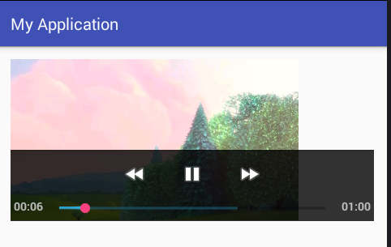
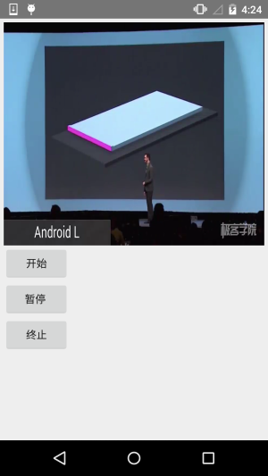

# 11.1音频与视频的播放

## 11.1.4 使用VideoView播放视频

​	为了在Android应用中播放视频，Android提供了VideoView组件，它就是一个位于android.widget包下的组件，它的作用与ImageView类似，只是ImageView用于显示图片，而VideoView用于播放视频。

使用VideoView播放视频的步骤：

1. 在界面布局文件中定义VideoView组件，或在程序中创建VideoView组件。

2. 调用VideoView的如下两个方法来加载指定的视频。

   ​	setVidePath(String path)：加载path文件代表的视频。

   ​	setVideoURI(Uri uri)：加载uri所对应的视频。

3. 调用VideoView的start()、stop()、psuse()方法来控制视频的播放

​       实际上与VideoView一起结合使用的还有一个MediaController类，它的作用是提供一个友好的图形控制界面，通过该控制界面来控制视频的播放。

​	下面的程序示范了如何使用VideoView来播放视频。该程序提供了一个简单的界面，界面布局代码如下。

```
<?xml version="1.0" encoding="utf-8"?>
<LinearLayout xmlns:android="http://schemas.android.com/apk/res/android"
	android:orientation="vertical"
	android:layout_width="match_parent"
	android:layout_height="match_parent">
	<!-- 定义VideoView播放视频 -->
	<VideoView
		android:id="@+id/video"
		android:layout_width="match_parent"
		android:layout_height="match_parent" />
</LinearLayout>
```

​	上面的界面布局中定义了一个VideoView组件，接下来就可以在程序中使用该组件来播放视频了。播放视频时还结合了MediaController来控制视频的播放，该程序代码如下。

```
public class MainActivity extends Activity
{
	VideoView videoView;
	MediaController mController;
	@Override
	public void onCreate(Bundle savedInstanceState)
	{
		super.onCreate(savedInstanceState);
		getWindow().setFormat(PixelFormat.TRANSLUCENT);
		setContentView(R.layout.main);
		// 获取界面上VideoView组件
		videoView = (VideoView) findViewById(R.id.video);
		// 创建MediaController对象
		mController = new MediaController(this);
		File video = new File("/mnt/sdcard/movie.mp4");
		if(video.exists())
		{
			videoView.setVideoPath(video.getAbsolutePath());  // ①
			// 设置videoView与mController建立关联
			videoView.setMediaController(mController);  // ②
			// 设置mController与videoView建立关联
			mController.setMediaPlayer(videoView);  // ③
			// 让VideoView获取焦点
			videoView.requestFocus();
		}
	}
}
```

​	由于该程序需要读取SD卡上的视频文件，因此还需要在AndroidManifest.xml文件中增加如下代码片段:

```
<!-- 授予该程序读取外部存储器的权限 -->
	<uses-permission android:name="android.permission.READ_EXTERNAL_STORAGE"/>
```

​	运行该程序，在保证/mnt/sdcard/movie.mp4视频文件存在的前提下，将可以看到如下图所示。



​	图中的快进键、暂停键、后退键以及播放进度条就是由MediaController所提供的。

**提示：运行该程序可能会遇到一些问题，如果读者使用了一些非标准的MP4、3GP文件，那么该应用程序将无法播放，因此建议读者自行使用手机录制一段兼容各种手机的标准的MP4、3GP视频文件。**

## 11.1.5 使用MediaPlayer和SurfaceView播放视频

​	使用VideoView播放视频简单、方便，但有些早期的开发这还是更喜欢使用MediaPlayer来播放视频，但由于MediaPlayer主要用于播放音频，因此它没有提供图像输出界面，此时就需要借助于SurfaceView来显示MediaPlayer播放的图像输出。

使用MediaPlayer播放视频的步骤如下。

1. 创建MediaPlyer的对象，并让他加载指定的视频文件。
2. 在界面布局文件中定义SurfaceView组件，或在程序中创建SurfaceView组件。并为SurfaceView的SurfaceHolder添加Callback监听器。
3. 调用MediaPlayer对象的setDisplay(Surfaceolder sh)将所播放的视频图像输出到指定的SurfaceView组件。
4. 调用MediaPlayer对象的start()、stop()、和pause()方法控制视频的播放。

​       下面的程序使用了MediaPlayer和SurfaceView来播放视频，并为该程序提供了三个按钮来控制视频的播放、暂停和停止。该程序的界面布局比较简单，故此处不再给出界面布局文件。该程序的代码如下。

```
public class MainActivity extends Activity
	implements OnClickListener
{
	SurfaceView surfaceView;
	ImageButton play, pause, stop;
	MediaPlayer mPlayer;
	// 记录当前视频的播放位置
	int position;
	@Override
	public void onCreate(Bundle savedInstanceState)
	{
		super.onCreate(savedInstanceState);
		setContentView(R.layout.main);
		// 获取界面中的三个按钮
		play = (ImageButton) findViewById(R.id.play);
		pause = (ImageButton) findViewById(R.id.pause);
		stop = (ImageButton) findViewById(R.id.stop);
		// 为三个按钮的单击事件绑定事件监听器
		play.setOnClickListener(this);
		pause.setOnClickListener(this);
		stop.setOnClickListener(this);
		// 创建MediaPlayer
		mPlayer = new MediaPlayer();
		surfaceView = (SurfaceView) this.findViewById(R.id.surfaceView);
		// 设置播放时打开屏幕
		surfaceView.getHolder().setKeepScreenOn(true);
		surfaceView.getHolder().addCallback(new SurfaceListener());
	}
	@Override
	public void onClick(View source)
	{
		try
		{
			switch (source.getId())
			{
				// 播放按钮被单击
				case R.id.play:
					play();
					break;
				// 暂停按钮被单击
				case R.id.pause:
					if (mPlayer.isPlaying())
					{
						mPlayer.pause();
					}
					else
					{
						mPlayer.start();
					}
					break;
				// 停止按钮被单击
				case R.id.stop:
					if (mPlayer.isPlaying()) mPlayer.stop();
					break;
			}
		}
		catch (Exception e)
		{
			e.printStackTrace();
		}
	}
	private void play() throws IOException
	{
		mPlayer.reset();
		mPlayer.setAudioStreamType(AudioManager.STREAM_MUSIC);
		// 设置需要播放的视频
		mPlayer.setDataSource("/mnt/sdcard/movie.3gp");
		// 把视频画面输出到SurfaceView
		mPlayer.setDisplay(surfaceView.getHolder());  // ①
		mPlayer.prepare();
		// 获取窗口管理器
		WindowManager wManager = getWindowManager();
		DisplayMetrics metrics = new DisplayMetrics();
		// 获取屏幕大小
		wManager.getDefaultDisplay().getMetrics(metrics);
		// 设置视频保持纵横比缩放到占满整个屏幕
		surfaceView.setLayoutParams(new LayoutParams(metrics.widthPixels
				, mPlayer.getVideoHeight() * metrics.widthPixels
				/ mPlayer.getVideoWidth()));
		mPlayer.start();
	}
	private class SurfaceListener implements SurfaceHolder.Callback
	{
		@Override
		public void surfaceChanged(SurfaceHolder holder, int format,
								   int width, int height)
		{
		}
		@Override
		public void surfaceCreated(SurfaceHolder holder)
		{
			if (position > 0)
			{
				try
				{
					// 开始播放
					play();
					// 并直接从指定位置开始播放
					mPlayer.seekTo(position);
					position = 0;
				}
				catch (Exception e)
				{
					e.printStackTrace();
				}
			}
		}
		@Override
		public void surfaceDestroyed(SurfaceHolder holder)
		{
		}
	}
	// 当其他Activity被打开时，暂停播放
	@Override
	protected void onPause()
	{
		if (mPlayer.isPlaying())
		{
			// 保存当前的播放位置
			position = mPlayer.getCurrentPosition();
			mPlayer.stop();
		}
		super.onPause();
	}
	@Override
	protected void onDestroy()
	{
		// 停止播放
		if (mPlayer.isPlaying()) mPlayer.stop();
		// 释放资源
		mPlayer.release();
		super.onDestroy();
	}
}
```

​	改程序同样需要访问SD卡上的视频文件，因此也需要在AndroidManifest.xml文件中增加如下配置：

```
<!-- 授予该程序读取外部存储器的权限 -->
	<uses-permission android:name="android.permission.READ_EXTERNAL_STORAGE"/>
```

​	运行上面的程序，将可以看到如图所示的播放界面。



​	从上面的开发过程不难看出，使用MediaPlayer播放视频要复杂一些，而且需要自己开发控制按钮来控制视频播放，因此一般推荐使用VideoView来播放视频。