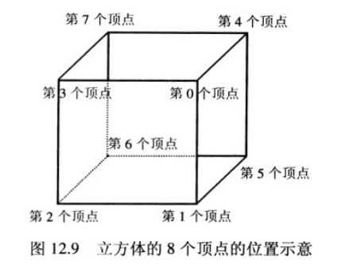
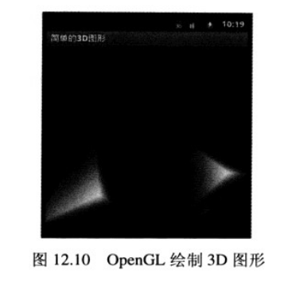
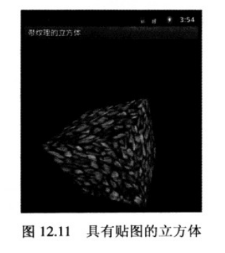

# 12.4 绘制3D图形

### 12.4.1 构建3D图形

正如前面介绍的，使用OpenGLES绘制3D图形的方法与绘制2D图形的步骤大致相同， 只是绘制3D图形需要定义更多的顶点数据，而且3D图形需要绘制更多的三角形。

如果还使用前面介绍的glDrawArrays(int mode, int first, int count)进行绘制，我们将会面临一个巨大的考验：到底要按怎样的顺序来组织三维空间上的多个顶点，才能绘制出我们需要的三角形？为了解决这个问题，GL10提供了如下方法。

> gIDrawElements (int mode, int count, int type, Buffer indices):根据 indices 指定的索引点来绘制三角形。该方法的第一个参数指定绘制的图形的类型，可设为 GL10.GL_TRIANGLES 或 GL10.GL_TRIANGLE_STRIP;第二个参数指定一共包含多少个顶点。indices参数最重要，它包装了一个长度为3N的数组，比如让该参 数包装{0,2,3,1,4,5}数组，这意味着告诉OpenGL ES要绘制两个三角形，第一个三角形的三个顶点为0、2、3个顶点，第二个三角形的三个顶点为1、4、5个顶点。

由此可见，如果希望在程序中使用glDrawElements (int mode, int count，int type，Buffer indices)方法来绘制3D图形，不仅需要指定每个3D图形的顶点位置信息，也需要指定3D图 形的每个面由哪三个顶点组成。

下面的程序使用glDrawElements (int mode，int count, int type, Buffer indices)方法绘制了 两个简单的3D图形:三棱锥和立方体，该程序的Activity依然没有变化。故下面只给出Renderer实现类的代码。

```

public class MyRenderer implements Renderer

{

// 定义三棱椎的4个顶点

float[] taperVertices = new float[] {

0.0f, 0.5f, 0.0f,

-0.5f, -0.5f, -0.2f,

0.5f, -0.5f, -0.2f,

0.0f, -0.2f, 0.2f

};

// 定义三棱椎的4个顶点的颜色

int[] taperColors = new int[]{

65535, 0, 0, 0, // 红色

0, 65535, 0, 0, // 绿色

0, 0, 65535, 0, // 蓝色

65535, 65535, 0, 0 //黄色

};

// 定义三棱椎的4个三角面

private byte[] taperFacets = new byte[]{

0, 1, 2, // 0、1、2三个顶点组成一个面

0, 1, 3, // 0、1、3三个顶点组成一个面

1, 2, 3, // 1、2、3三个顶点组成一个面

0, 2, 3 // 0、2、3三个顶点组成一个面

};

// 定义立方体的8个顶点

float[] cubeVertices = new float[] {

// 上顶面正方形的4个顶点

0.5f, 0.5f, 0.5f,

0.5f, -0.5f, 0.5f,

-0.5f, -0.5f, 0.5f,

-0.5f, 0.5f, 0.5f,

// 下底面正方形的4个顶点

0.5f, 0.5f, -0.5f,

0.5f, -0.5f, -0.5f,

-0.5f, -0.5f, -0.5f,

-0.5f, 0.5f, -0.5f

};

// 定义立方体所需要的6个面（一共是12个三角形所需的顶点）

private byte[] cubeFacets = new byte[]{

0, 1, 2,

0, 2, 3,

2, 3, 7,

2, 6, 7,

0, 3, 7,

0, 4, 7,

4, 5, 6,

4, 6, 7,

0, 1, 4,

1, 4, 5,

1, 2, 6,

1, 5, 6

};

// 定义Open GL ES绘制所需要的Buffer对象

FloatBuffer taperVerticesBuffer;

IntBuffer taperColorsBuffer;

ByteBuffer taperFacetsBuffer;

FloatBuffer cubeVerticesBuffer;

ByteBuffer cubeFacetsBuffer;

// 控制旋转的角度

private float rotate;

public MyRenderer()

{

// 将三棱椎的顶点位置数据数组包装成FloatBuffer

taperVerticesBuffer = floatBufferUtil(taperVertices);

// 将三棱椎的4个面的数组包装成ByteBuffer

taperFacetsBuffer = ByteBuffer.wrap(taperFacets);

// 将三棱椎的4个定点的颜色数组包装成IntBuffer

taperColorsBuffer = intBufferUtil(taperColors);

// 将立方体的顶点位置数据数组包装成FloatBuffer

cubeVerticesBuffer = floatBufferUtil(cubeVertices);

// 将立方体的6个面（12个三角形）的数组包装成ByteBuffer

cubeFacetsBuffer = ByteBuffer.wrap(cubeFacets);

}

@Override

public void onSurfaceCreated(GL10 gl, EGLConfig config)

{

// 关闭抗抖动

gl.glDisable(GL10.GL_DITHER);

// 设置系统对透视进行修正

gl.glHint(GL10.GL_PERSPECTIVE_CORRECTION_HINT, GL10.GL_FASTEST);

gl.glClearColor(0, 0, 0, 0);

// 设置阴影平滑模式

gl.glShadeModel(GL10.GL_SMOOTH);

// 启用深度测试

gl.glEnable(GL10.GL_DEPTH_TEST);

// 设置深度测试的类型

gl.glDepthFunc(GL10.GL_LEQUAL);

}

@Override

public void onSurfaceChanged(GL10 gl, int width, int height)

{

// 设置3D视窗的大小及位置

gl.glViewport(0, 0, width, height);

// 将当前矩阵模式设为投影矩阵

gl.glMatrixMode(GL10.GL_PROJECTION);

// 初始化单位矩阵

gl.glLoadIdentity();

// 计算透视视窗的宽度、高度比

float ratio = (float) width / height;

// 调用此方法设置透视视窗的空间大小。

gl.glFrustumf(-ratio, ratio, -1, 1, 1, 10);

}

// 绘制图形的方法

@Override

public void onDrawFrame(GL10 gl)

{

// 清除屏幕缓存和深度缓存

gl.glClear(GL10.GL_COLOR_BUFFER_BIT | GL10.GL_DEPTH_BUFFER_BIT);

// 启用顶点坐标数据

gl.glEnableClientState(GL10.GL_VERTEX_ARRAY);

// 启用顶点颜色数据

gl.glEnableClientState(GL10.GL_COLOR_ARRAY);

// 设置当前矩阵模式为模型视图。

gl.glMatrixMode(GL10.GL_MODELVIEW);

// --------------------绘制第一个图形---------------------

// 重置当前的模型视图矩阵

gl.glLoadIdentity();

gl.glTranslatef(-0.6f, 0.0f, -1.5f);

// 沿着Y轴旋转

gl.glRotatef(rotate, 0f, 0.2f, 0f);

// 设置顶点的位置数据

gl.glVertexPointer(3, GL10.GL_FLOAT, 0, taperVerticesBuffer);

// 设置顶点的颜色数据

gl.glColorPointer(4, GL10.GL_FIXED, 0, taperColorsBuffer);

// 按taperFacetsBuffer指定的面绘制三角形

gl.glDrawElements(GL10.GL_TRIANGLE_STRIP

, taperFacetsBuffer.remaining(),

GL10.GL_UNSIGNED_BYTE, taperFacetsBuffer);

// --------------------绘制第二个图形---------------------

// 重置当前的模型视图矩阵

gl.glLoadIdentity();

gl.glTranslatef(0.7f, 0.0f, -2.2f);

// 沿着Y轴旋转

gl.glRotatef(rotate, 0f, 0.2f, 0f);

// 沿着X轴旋转

gl.glRotatef(rotate, 1f, 0f, 0f);

// 设置顶点的位置数据

gl.glVertexPointer(3, GL10.GL_FLOAT, 0, cubeVerticesBuffer);

// 不设置顶点的颜色数据，还用以前的颜色数据

// 按cubeFacetsBuffer指定的面绘制三角形

gl.glDrawElements(GL10.GL_TRIANGLE_STRIP

, cubeFacetsBuffer.remaining(),

GL10.GL_UNSIGNED_BYTE, cubeFacetsBuffer);

// 绘制结束

gl.glFinish();

gl.glDisableClientState(GL10.GL_VERTEX_ARRAY);

// 旋转角度增加1

rotate+=1;

}

// 定义一个工具方法，将int[]数组转换为OpenGL ES所需的IntBuffer

private IntBuffer intBufferUtil(int[] arr)

public class MyRenderer implements Renderer
{
	// 定义三棱椎的4个顶点
	float[] taperVertices = new float[] {
			0.0f, 0.5f, 0.0f,
			-0.5f, -0.5f, -0.2f,
			0.5f, -0.5f, -0.2f,
			0.0f, -0.2f, 0.2f
	};
	// 定义三棱椎的4个顶点的颜色
	int[] taperColors = new int[]{
			65535, 0, 0, 0,  // 红色
			0, 65535, 0, 0,	 // 绿色
			0, 0, 65535, 0,  // 蓝色
			65535, 65535, 0, 0 //黄色
	};
	// 定义三棱椎的4个三角面
	private byte[] taperFacets = new byte[]{
			0, 1, 2, // 0、1、2三个顶点组成一个面
			0, 1, 3, // 0、1、3三个顶点组成一个面
			1, 2, 3, // 1、2、3三个顶点组成一个面
			0, 2, 3 // 0、2、3三个顶点组成一个面
	};
	// 定义立方体的8个顶点
	float[] cubeVertices = new float[] {
			// 上顶面正方形的4个顶点
			0.5f, 0.5f, 0.5f,
			0.5f, -0.5f, 0.5f,
			-0.5f, -0.5f, 0.5f,
			-0.5f, 0.5f, 0.5f,
			// 下底面正方形的4个顶点
			0.5f, 0.5f, -0.5f,
			0.5f, -0.5f, -0.5f,
			-0.5f, -0.5f, -0.5f,
			-0.5f, 0.5f, -0.5f
	};
	// 定义立方体所需要的6个面（一共是12个三角形所需的顶点）
	private byte[] cubeFacets = new byte[]{
			0, 1, 2,
			0, 2, 3,
			2, 3, 7,
			2, 6, 7,
			0, 3, 7,
			0, 4, 7,
			4, 5, 6,
			4, 6, 7,
			0, 1, 4,
			1, 4, 5,
			1, 2, 6,
			1, 5, 6
	};
	// 定义Open GL ES绘制所需要的Buffer对象
	FloatBuffer taperVerticesBuffer;
	IntBuffer taperColorsBuffer;
	ByteBuffer taperFacetsBuffer;
	FloatBuffer cubeVerticesBuffer;
	ByteBuffer cubeFacetsBuffer;
	// 控制旋转的角度
	private float rotate;
	public MyRenderer()
	{
		// 将三棱椎的顶点位置数据数组包装成FloatBuffer
		taperVerticesBuffer = floatBufferUtil(taperVertices);
		// 将三棱椎的4个面的数组包装成ByteBuffer
		taperFacetsBuffer = ByteBuffer.wrap(taperFacets);
		// 将三棱椎的4个定点的颜色数组包装成IntBuffer
		taperColorsBuffer = intBufferUtil(taperColors);
		// 将立方体的顶点位置数据数组包装成FloatBuffer
		cubeVerticesBuffer = floatBufferUtil(cubeVertices);
		// 将立方体的6个面（12个三角形）的数组包装成ByteBuffer
		cubeFacetsBuffer = ByteBuffer.wrap(cubeFacets);
	}
	@Override
	public void onSurfaceCreated(GL10 gl, EGLConfig config)
	{
		// 关闭抗抖动
		gl.glDisable(GL10.GL_DITHER);
		// 设置系统对透视进行修正
		gl.glHint(GL10.GL_PERSPECTIVE_CORRECTION_HINT, GL10.GL_FASTEST);
		gl.glClearColor(0, 0, 0, 0);
		// 设置阴影平滑模式
		gl.glShadeModel(GL10.GL_SMOOTH);
		// 启用深度测试
		gl.glEnable(GL10.GL_DEPTH_TEST);
		// 设置深度测试的类型
		gl.glDepthFunc(GL10.GL_LEQUAL);
	}
	@Override
	public void onSurfaceChanged(GL10 gl, int width, int height)
	{
		// 设置3D视窗的大小及位置
		gl.glViewport(0, 0, width, height);
		// 将当前矩阵模式设为投影矩阵
		gl.glMatrixMode(GL10.GL_PROJECTION);
		// 初始化单位矩阵
		gl.glLoadIdentity();
		// 计算透视视窗的宽度、高度比
		float ratio = (float) width / height;
		// 调用此方法设置透视视窗的空间大小。
		gl.glFrustumf(-ratio, ratio, -1, 1, 1, 10);
	}
	// 绘制图形的方法
	@Override
	public void onDrawFrame(GL10 gl)
	{
		// 清除屏幕缓存和深度缓存
		gl.glClear(GL10.GL_COLOR_BUFFER_BIT | GL10.GL_DEPTH_BUFFER_BIT);
		// 启用顶点坐标数据
		gl.glEnableClientState(GL10.GL_VERTEX_ARRAY);
		// 启用顶点颜色数据
		gl.glEnableClientState(GL10.GL_COLOR_ARRAY);
		// 设置当前矩阵模式为模型视图。
		gl.glMatrixMode(GL10.GL_MODELVIEW);
		// --------------------绘制第一个图形---------------------
		// 重置当前的模型视图矩阵
		gl.glLoadIdentity();
		gl.glTranslatef(-0.6f, 0.0f, -1.5f);
		// 沿着Y轴旋转
		gl.glRotatef(rotate, 0f, 0.2f, 0f);
		// 设置顶点的位置数据
		gl.glVertexPointer(3, GL10.GL_FLOAT, 0, taperVerticesBuffer);
		// 设置顶点的颜色数据
		gl.glColorPointer(4, GL10.GL_FIXED, 0, taperColorsBuffer);
		// 按taperFacetsBuffer指定的面绘制三角形
		gl.glDrawElements(GL10.GL_TRIANGLE_STRIP
				, taperFacetsBuffer.remaining(),
				GL10.GL_UNSIGNED_BYTE, taperFacetsBuffer);
		// --------------------绘制第二个图形---------------------
		// 重置当前的模型视图矩阵
		gl.glLoadIdentity();
		gl.glTranslatef(0.7f, 0.0f, -2.2f);
		// 沿着Y轴旋转
		gl.glRotatef(rotate, 0f, 0.2f, 0f);
		// 沿着X轴旋转
		gl.glRotatef(rotate, 1f, 0f, 0f);
		// 设置顶点的位置数据
		gl.glVertexPointer(3, GL10.GL_FLOAT, 0, cubeVerticesBuffer);
		// 不设置顶点的颜色数据，还用以前的颜色数据
		// 按cubeFacetsBuffer指定的面绘制三角形
		gl.glDrawElements(GL10.GL_TRIANGLE_STRIP
				, cubeFacetsBuffer.remaining(),
				GL10.GL_UNSIGNED_BYTE, cubeFacetsBuffer);
		// 绘制结束
		gl.glFinish();
		gl.glDisableClientState(GL10.GL_VERTEX_ARRAY);
		// 旋转角度增加1
		rotate+=1;
	}
	// 定义一个工具方法，将int[]数组转换为OpenGL ES所需的IntBuffer
	private IntBuffer intBufferUtil(int[] arr)
	{
		IntBuffer mBuffer;
		// 初始化ByteBuffer，长度为arr数组的长度*4，因为一个int占4个字节
		ByteBuffer qbb = ByteBuffer.allocateDirect(arr.length * 4);
		// 数组排列用nativeOrder
		qbb.order(ByteOrder.nativeOrder());
		mBuffer = qbb.asIntBuffer();
		mBuffer.put(arr);
		mBuffer.position(0);
		return mBuffer;
	}
	// 定义一个工具方法，将float[]数组转换为OpenGL ES所需的FloatBuffer
	private FloatBuffer floatBufferUtil(float[] arr)
	{
		FloatBuffer mBuffer;
		// 初始化ByteBuffer，长度为arr数组的长度*4，因为一个int占4个字节
		ByteBuffer qbb = ByteBuffer.allocateDirect(arr.length * 4);
		// 数组排列用nativeOrder
		qbb.order(ByteOrder.nativeOrder());
		mBuffer = qbb.asFloatBuffer();
		mBuffer.put(arr);
		mBuffer.position(0);
		return mBuffer;
	}
}

```

从上面的程序不难看出，绘制3D图形的步骤与绘制2D图形的步骤基本相似，区别只是绘制3D图形不仅需要定义各顶点位置的坐标，还需要定义3D图形的各个三角面由哪些顶点组成，例如上面的程序中粗体字代码所示：为了定义一个立方体，除了给出这个立方体的8 个顶点位置坐标之外，还需要定义组成该立方体的12个三角形。如图12.9显示了该立方体上8个顶点的位置。

接下来程序需要把图12.9所示正方形的6个面（由12个三角形组成）定义出来，依次指定每个三角形包括哪三个顶点，也就是使程序中粗体字代码所定义的数组。

运行上面的程序，将可以看到如图12.10所示的3D图形。
 
 
从上面的程序可以看出，为了在程序中绘制一个简单的3D立方体，程序需要定义12个三角面，这种规则的立方体还可以由程序员计算并指定，但如果遇到更复杂的3D物体，就必须借助于三维建模软件了。

### 12.4.2 应用纹理贴图

为了让3D图形更加逼真，我们需要为这些3D图形应用纹理贴图，比如开发一个怪兽头部，如果只是为这个头部绘制五颜六色的“皮肤”，那也太假了吧。如果考虑为这个怪兽应用“鳄鱼皮肤”的纹理图，或者应用“蟒蛇皮肤”的纹理贴图，这个怪兽头部就“逼真”得多了，甚至会带给人一种恐怖的感觉了。

为了在OpenGL ES中启用纹理贴图功能，可以在Renderer实现类的`onSurfaceCreated (GL10 gl，EGLConfig config)`方法中启动纹理贴图，例如如下代码：

```

//启用2D纹理贴图

gl.glEnable (GL10 .GL_TEXTURE_2D);

```

接下来就需要准备一张图片来作为纹理贴图了，建议该图片的长宽是2的N次方，比如长、宽为256, 512等。把这张准备贴图的位图放在Android项目的res/drawable-mdpi目录下，方便应用程序加载该图片资源。

接下来程序开始记载该图片并生成对应的纹理贴图，例如如下方法。

```

//加载位图

bitmap = BitmapFactory.decodeResource (context .getResources (),

R.drawable.sand);

int[] textures = new int[1];

//指定生成n个纹理（第一个参数指定生成一个纹理）

// textures数组将负责存储所有纹理的代号 gl.glGenTextures(1, textures, 0);

//获取textures纹理数组中的第一个纹理 texture = textures[0];

//通知OpenGL将texture纹理绑定到GL10.GL_TEXTURE_2D目标中 gl.glBindTexture(GL10.GL_TEXTURE_2D, texture);

//设置纹理被缩小（距离视点很远时被缩小）时候的滤波方式 gl.glTexParameterf(GL10.GL_TEXTURE_2D,

GL10.GL_TEXTURE_MIN_FILTER, GL10.GL_NEAREST);

//设置纹理被放大（距离视点很近时被方法）时候的滤波方式

gl.glTexParameterf(GL10.GL_TEXTURE_2D,

GL10.GL_TEXTURE_MAG_FILTER, GL10.GL_LINEAR);

//设置在横向、纵向上都是平铺纹理

gl•glTexParameterf(GL10.GL_TEXTURE_2D, GL10.GL_TEXTURE_WRAP_S,

GL10.GL_REPEAT);

gl.glTexParameterf(GL10.GL_TEXTURE_2D, GL10.GL_TEXTURE_WRAP_T,

GL10.GL_REPEAT);

//加载位图生成纹理

GLUtils. texImage2D(GL10.GL_TEXTURE_2D, 0, bitmap, 0);

```

上面的程序中用到了 GL10的如下方法。

> glGenTextures(int n, int[] textures, int offset)该方法指定一次性生成 n 个纹理，该方法所生成的纹理的代号放入其中textures数组中，offset指定从第几个数组元素开始存放纹理代号。

> glBindTexture(int target, int texture):该方法用于将 texture 纹理绑定到 target 目标上。

> glTexParameterf(int target, int pname, float param):该方法用于为 target 纹理目标设置属性，其中第二个参数是属性名，第三个参数是属性值。

上面的程序中有 4 行代码调用了 glTexParameterf(int target，int pname，float param)方法， 程序设置了当纹理被放大时使用GL10.GL_LINEAR滤波方式；当纹理被缩小时使用 GL10.GL_NEAREST滤波方式；一般来说，使用GL10.GL_L1NEAR滤波方式有较好的效果，但系统开销略微大了一些，具体采用哪种滤波方式则取决于目标机器本身的性能。

上面代码的最后一行调用了GLUtils工具类的方法来加载指定位图，并根据位图来生成 纹理，通过上面的代码即可得到一个用于贴图的纹理了。

在3D绘制中进行纹理贴图也很简单，与设置顶点颜色的步骤相似，只要三步：

> 设置启用贴图坐标数组。

设置贴图坐标的数组信息。

调用 GL10 的 glBindTexture (int target，int texture)方法执行贴图。

下面的程序示范如何为一个立方体进行贴图，而且这个程序提供了手势检测器，允许用 户通过手势来改变该立方体的角度。程序代码如下。

```

public class MainActivity extends Activity
		implements OnGestureListener
{
	// 定义旋转角度
	private float anglex = 0f;
	private float angley = 0f;
	static final float ROTATE_FACTOR = 60;
	// 定义手势检测器实例
	GestureDetector detector;
	@Override
	public void onCreate(Bundle savedInstanceState)
	{
		super.onCreate(savedInstanceState);
		// 创建一个GLSurfaceView，用于显示OpenGL绘制的图形
		GLSurfaceView glView = new GLSurfaceView(this);
		// 创建GLSurfaceView的内容绘制器
		MyRenderer myRender = new MyRenderer(this);
		// 为GLSurfaceView设置绘制器
		glView.setRenderer(myRender);
		setContentView(glView);
		// 创建手势检测器
		detector = new GestureDetector(this , this);
	}
	@Override
	public boolean onTouchEvent(MotionEvent me)
	{
		// 将该Activity上的触碰事件交给GestureDetector处理
		return detector.onTouchEvent(me);
	}
	@Override
	public boolean onFling(MotionEvent event1, MotionEvent event2,
		float velocityX, float velocityY)
	{
		velocityX = velocityX > 2000 ? 2000 : velocityX;
		velocityX = velocityX < -2000 ? -2000 : velocityX;
		velocityY = velocityY > 2000 ? 2000 : velocityY;
		velocityY = velocityY < -2000 ? -2000 : velocityY;
		// 根据横向上的速度计算沿Y轴旋转的角度
		angley += velocityX * ROTATE_FACTOR / 4000;
		// 根据纵向上的速度计算沿X轴旋转的角度
		anglex += velocityY * ROTATE_FACTOR / 4000;
		return true;
	}
	@Override
	public boolean onDown(MotionEvent arg0)
	{
		return false;
	}
	@Override
	public void onLongPress(MotionEvent event)
	{
	}
	@Override
	public boolean onScroll(MotionEvent event1, MotionEvent event2,
							float distanceX, float distanceY)
	{
		return false;
	}
	@Override
	public void onShowPress(MotionEvent event)
	{
	}
	@Override
	public boolean onSingleTapUp(MotionEvent event)
	{
		return false;
	}
	public class MyRenderer implements Renderer
	{
		// 立方体的顶点坐标（一共是36个顶点，组成12个三角形）
		private float[] cubeVertices = { -0.6f, -0.6f, -0.6f, -0.6f, 0.6f,
				-0.6f, 0.6f, 0.6f, -0.6f, 0.6f, 0.6f, -0.6f, 0.6f, -0.6f, -0.6f,
				-0.6f, -0.6f, -0.6f, -0.6f, -0.6f, 0.6f, 0.6f, -0.6f, 0.6f, 0.6f,
				0.6f, 0.6f, 0.6f, 0.6f, 0.6f, -0.6f, 0.6f, 0.6f, -0.6f, -0.6f,
				0.6f, -0.6f, -0.6f, -0.6f, 0.6f, -0.6f, -0.6f, 0.6f, -0.6f, 0.6f,
				0.6f, -0.6f, 0.6f, -0.6f, -0.6f, 0.6f, -0.6f, -0.6f, -0.6f, 0.6f,
				-0.6f, -0.6f, 0.6f, 0.6f, -0.6f, 0.6f, 0.6f, 0.6f, 0.6f, 0.6f,
				0.6f, 0.6f, -0.6f, 0.6f, 0.6f, -0.6f, -0.6f, 0.6f, 0.6f, -0.6f,
				-0.6f, 0.6f, -0.6f, -0.6f, 0.6f, 0.6f, -0.6f, 0.6f, 0.6f, 0.6f,
				0.6f, 0.6f, 0.6f, 0.6f, -0.6f, -0.6f, 0.6f, -0.6f, -0.6f, -0.6f,
				-0.6f, -0.6f, -0.6f, 0.6f, -0.6f, -0.6f, 0.6f, -0.6f, 0.6f, 0.6f,
				-0.6f, 0.6f, -0.6f, };
		// 定义立方体所需要的6个面（一共是12个三角形所需的顶点）
		private byte[] cubeFacets = { 0, 1, 2, 3, 4, 5, 6, 7, 8, 9, 10, 11, 12,
				13, 14, 15, 16, 17, 18, 19, 20, 21, 22, 23, 24, 25, 26, 27, 28, 29,
				30, 31, 32, 33, 34, 35, };
		// 定义纹理贴图的坐标数据
		private float[] cubeTextures = { 1.0000f, 1.0000f, 1.0000f, 0.0000f,
				0.0000f, 0.0000f, 0.0000f, 0.0000f, 0.0000f, 1.0000f, 1.0000f,
				1.0000f, 0.0000f, 1.0000f, 1.0000f, 1.0000f, 1.0000f, 0.0000f,
				1.0000f, 0.0000f, 0.0000f, 0.0000f, 0.0000f, 1.0000f, 0.0000f,
				1.0000f, 1.0000f, 1.0000f, 1.0000f, 0.0000f, 1.0000f, 0.0000f,
				0.0000f, 0.0000f, 0.0000f, 1.0000f, 0.0000f, 1.0000f, 1.0000f,
				1.0000f, 1.0000f, 0.0000f, 1.0000f, 0.0000f, 0.0000f, 0.0000f,
				0.0000f, 1.0000f, 0.0000f, 1.0000f, 1.0000f, 1.0000f, 1.0000f,
				0.0000f, 1.0000f, 0.0000f, 0.0000f, 0.0000f, 0.0000f, 1.0000f,
				0.0000f, 1.0000f, 1.0000f, 1.0000f, 1.0000f, 0.0000f, 1.0000f,
				0.0000f, 0.0000f, 0.0000f, 0.0000f, 1.0000f };
		private Context context;
		private FloatBuffer cubeVerticesBuffer;
		private ByteBuffer cubeFacetsBuffer;
		private FloatBuffer cubeTexturesBuffer;
		// 定义本程序所使用的纹理
		private int texture;
		public MyRenderer(Context main)
		{
			this.context = main;
			// 将立方体的顶点位置数据数组包装成FloatBuffer;
			cubeVerticesBuffer = floatBufferUtil(cubeVertices);
			// 将立方体的6个面（12个三角形）的数组包装成ByteBuffer
			cubeFacetsBuffer = ByteBuffer.wrap(cubeFacets);
			// 将立方体的纹理贴图的坐标数据包装成FloatBuffer
			cubeTexturesBuffer = floatBufferUtil(cubeTextures);
		}
		@Override
		public void onSurfaceCreated(GL10 gl, EGLConfig config)
		{
			// 关闭抗抖动
			gl.glDisable(GL10.GL_DITHER);
			// 设置系统对透视进行修正
			gl.glHint(GL10.GL_PERSPECTIVE_CORRECTION_HINT, GL10.GL_FASTEST);
			gl.glClearColor(0, 0, 0, 0);
			// 设置阴影平滑模式
			gl.glShadeModel(GL10.GL_SMOOTH);
			// 启用深度测试
			gl.glEnable(GL10.GL_DEPTH_TEST);
			// 设置深度测试的类型
			gl.glDepthFunc(GL10.GL_LEQUAL);
			// 启用2D纹理贴图
			gl.glEnable(GL10.GL_TEXTURE_2D);
			// 装载纹理
			loadTexture(gl);
		}
		@Override
		public void onSurfaceChanged(GL10 gl, int width, int height)
		{
			// 设置3D视窗的大小及位置
			gl.glViewport(0, 0, width, height);
			// 将当前矩阵模式设为投影矩阵
			gl.glMatrixMode(GL10.GL_PROJECTION);
			// 初始化单位矩阵
			gl.glLoadIdentity();
			// 计算透视视窗的宽度、高度比
			float ratio = (float) width / height;
			// 调用此方法设置透视视窗的空间大小。
			gl.glFrustumf(-ratio, ratio, -1, 1, 1, 10);
		}
		public void onDrawFrame(GL10 gl)
		{
			// 清除屏幕缓存和深度缓存
			gl.glClear(GL10.GL_COLOR_BUFFER_BIT | GL10.GL_DEPTH_BUFFER_BIT);
			// 启用顶点坐标数据
			gl.glEnableClientState(GL10.GL_VERTEX_ARRAY);
			// 启用贴图坐标数组数据
			gl.glEnableClientState(GL10.GL_TEXTURE_COORD_ARRAY);   // ①
			// 设置当前矩阵模式为模型视图。
			gl.glMatrixMode(GL10.GL_MODELVIEW);
			gl.glLoadIdentity();
			// 把绘图中心移入屏幕2个单位
			gl.glTranslatef(0f, 0.0f, -2.0f);
			// 旋转图形
			gl.glRotatef(angley, 0, 1, 0);
			gl.glRotatef(anglex, 1, 0, 0);
			// 设置顶点的位置数据
			gl.glVertexPointer(3, GL10.GL_FLOAT, 0, cubeVerticesBuffer);
			// 设置贴图的坐标数据
			gl.glTexCoordPointer(2, GL10.GL_FLOAT, 0, cubeTexturesBuffer);  // ②
			// 执行纹理贴图
			gl.glBindTexture(GL10.GL_TEXTURE_2D, texture);  // ③
			// 按cubeFacetsBuffer指定的面绘制三角形
			gl.glDrawElements(GL10.GL_TRIANGLES, cubeFacetsBuffer.remaining(),
					GL10.GL_UNSIGNED_BYTE, cubeFacetsBuffer);
			// 绘制结束
			gl.glFinish();
			// 禁用顶点、纹理坐标数组
			gl.glDisableClientState(GL10.GL_VERTEX_ARRAY);
			gl.glDisableClientState(GL10.GL_TEXTURE_COORD_ARRAY);
			// 递增角度值以便每次以不同角度绘制
		}
		private void loadTexture(GL10 gl)
		{
			Bitmap bitmap = null;
			try
			{
				// 加载位图
				bitmap = BitmapFactory.decodeResource(context.getResources(),
						R.drawable.sand);
				int[] textures = new int[1];
				// 指定生成N个纹理（第一个参数指定生成一个纹理）
				// textures数组将负责存储所有纹理的代号
				gl.glGenTextures(1, textures, 0);
				// 获取textures纹理数组中的第一个纹理
				texture = textures[0];
				// 通知OpenGL将texture纹理绑定到GL10.GL_TEXTURE_2D目标中
				gl.glBindTexture(GL10.GL_TEXTURE_2D, texture);
				// 设置纹理被缩小（距离视点很远时被缩小）时的滤波方式
				gl.glTexParameterf(GL10.GL_TEXTURE_2D,
						GL10.GL_TEXTURE_MIN_FILTER, GL10.GL_NEAREST);
				// 设置纹理被放大（距离视点很近时被方法）时的滤波方式
				gl.glTexParameterf(GL10.GL_TEXTURE_2D,
						GL10.GL_TEXTURE_MAG_FILTER, GL10.GL_LINEAR);
				// 设置在横向、纵向上都是平铺纹理
				gl.glTexParameterf(GL10.GL_TEXTURE_2D, GL10.GL_TEXTURE_WRAP_S,
						GL10.GL_REPEAT);
				gl.glTexParameterf(GL10.GL_TEXTURE_2D, GL10.GL_TEXTURE_WRAP_T,
						GL10.GL_REPEAT);
				// 加载位图生成纹理
				GLUtils.texImage2D(GL10.GL_TEXTURE_2D, 0, bitmap, 0);
			}
			finally
			{
				// 生成纹理之后，回收位图
				if (bitmap != null)
					bitmap.recycle();
			}
		}
	}

	// 定义一个工具方法，将float[]数组转换为OpenGL ES所需的FloatBuffer
	private FloatBuffer floatBufferUtil(float[] arr)
	{
		FloatBuffer mBuffer;
		// 初始化ByteBuffer，长度为arr数组的长度*4，因为一个int占4个字节
		ByteBuffer qbb = ByteBuffer.allocateDirect(arr.length * 4);
		// 数组排列用nativeOrder
		qbb.order(ByteOrder.nativeOrder());
		mBuffer = qbb.asFloatBuffer();
		mBuffer.put(arr);
		mBuffer.position(0);
		return mBuffer;
	}
}

```

上面的程序中①、②、③号代码就完成纹理贴图的三个步骤。

程序中粗体字代码用于计算用户手势在X方向、Y方向上速度，并根据X方向、Y方向上的速度来改变立方体的旋转角度，这样就可以让该立方体随用户的手势而转动了。

可能有读者会发现上面这个立方体的顶点坐标看上去很“可怕”，怎么一个立方体需要这么多顶点呢？实际上是因为笔者实在不想在纸上先画这个立方体、再数立方体的每个三角面由哪些顶点组成，再计算每个三角面的贴图坐标——这太耗时间了。笔者直接使用3D max建了一个立方体模型，并从中导出了模型的每个顶点的位置信息、每个三角面由哪些顶点组成，以及贴图的坐标信息。

3D max就不会像我们之前那样“复用”立方体的顶点——它直接计算该立方体需要12 个三角面，每个三角面需要3个顶点，这样一共是36个顶点——其实有大量顶点的位置是相同，但3D max不管这些。它认为这个立方体需要36个顶点，每个顶点的位置需要X、Y、 Z三个坐标值，因此导出这个立方体的顶点坐标信息的数组就是一个长度为108的数组。

>由于本书只是介绍简单的OpenGL ES编程，因此涉及3D max的内容就此打住，如果读者还有更多兴趣，则可以参考3D max的相关资料。

运行上面的程序，用户将可以看到一个具有贴图纹理的三维立方体，用户可以通过拖动手势来旋转该立方体，程序效果如图12.11所示。
 

需要指出的是，OpenGL ES虽然只是OpenGL的一个子集，但其实它所包含的功能也很多，而本书的重点是介绍Android所支持的3D开发，限于篇幅，不可能深入介绍OpenGL ES 编程的全部内容，如果读者希望深入了解OpenGL编程的内容，可以自行参考相关书籍和资料。
