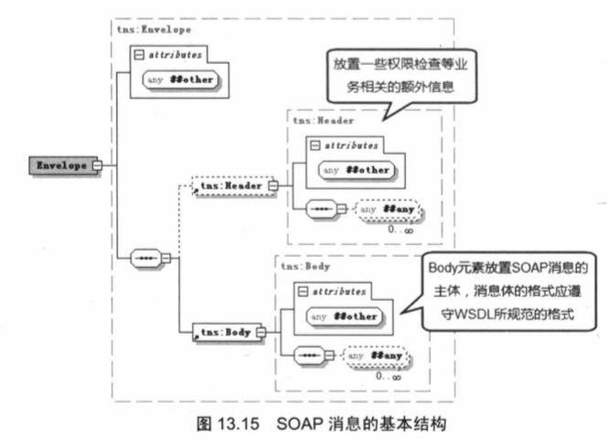
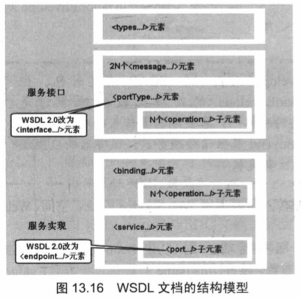
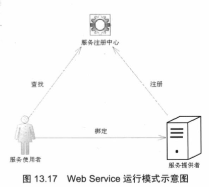
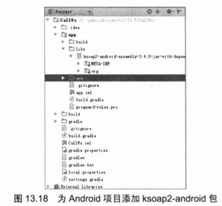
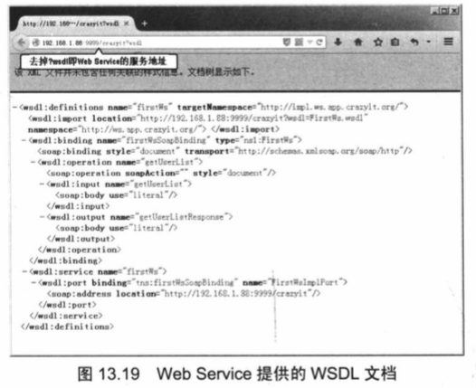
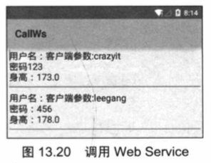

#13.5 使用Web Service进行网络编程
Android应用通常都运行在手机平台上，手机系统的硬件资源是有限的，不管是存储能力还是计算能力都有限，在Android系统上开发、运行一些单用户、小型应用是可能的，但对于需要进行大量的数据处理、复杂计算的应用，还是只能部署在远程服务器上，Android应用将只是充当这些应用的客户端。

为了让Android应用与远程服务器进行交互，可以借助Java的RMI技术，但这要求远程服务器程序必须采用Java实现；也可以借助CORBA技术，但这种技术显得过于复杂。除此之外，Web Service也是一种不错的选择。

##13.5.1 Web Service平台概述
Web Service平台主要涉及的技术有SOAP(Simple Object Access Protocol，简单对象访问协议)、WSDL(Web Service Description and Intergration，统一描述、发现和整合协议).  

1. SOAP
SOAP是一种具有扩展性的XML消息协议。SOAP允许一个应用程序向另一个应用程序发送XML消息，SOAP消息是从SOAP接收者的单路消息，任何应用程序均可作为发送者或接收者。SOAP仅定义消息结构和消息处理的协议，与底层的传输协议独立。因此，SOAP协议能通过HTTP、JMS或SMTP协议传输。  
SOAP依赖于XML文档来构建，一条SOAP消息就是一份特定的XML文档，SOAP消息包含如下三个主要元素。
 * &lt;Envelope.../>根元素，SOAP消息对应的XML文档以该元素作为根元素。
 * 可选的&lt;Header.../>元素，包含SOAP消息的头信息。
 * 必需的&lt;Body.../>元素，包含所有的调用的响应消息。

 就目前的SOAP消息的结构来看，&lt;Envelope.../>根元素通常只能包含两个子元素，其中第一个子元素是可选的&lt;Header.../>元素，第二个子元素是必需的&lt;Body.../>元素。  
图13.15显示了SOAP消息的基本结构。



2. WSDL  
WSDL使用XML描述Web Service，包括访问和使用Web Service所必需的信息，定义该Web Service位置、功能及如何通信等描述信息。  
一般来说，只要调用者能够获取Web Service对应的WSDL，就可以从中了解它所提供的服务及如何调用Web Service了。因为一份WSDL文件清晰地定义了三个方面的内容。
 * WHAT部分：用于定义Web Service所提供的操作（或方法），也就是Web Service能做些什么。由WSDL中的&lt;types.../>、&lt;message.../>和&lt;portType.../>元素定义。
 * HOW部分：用于定义如何访问Web Service，包括数据格式详情和访问Web Service操作的必要协议。也就是定义了如何访问Web Service。
 * WHERE部分：用于定义Web Service位于何处。该部分使用&lt;service.../>元素定义，可在WSDL文件的最后部分看到&lt;service.../>元素。  

 一份WSDL文档通常可分为两个部分。 
  
 * 第一个部分定义了服务接口，它在WSDL中由&lt;message.../>和&lt;portType.../>两个元素组成，其中&lt;message.../>元素定义了操作的交互方式；而&lt;portType.../>元素则可包含任意数量的&lt;operation.../>元素，每个&lt;operation.../>元素代表一个允许远程调用的操作（即方法）。
 * 第二个部分定义了服务实现，它在WSDL中由&lt;binding.../>元素定义使用特定的通信协议、数据编码模型和底层通信协议，将Web Service服务接口定义映射到具体实现；而&lt;service.../>元素则包含一系列&lt;port.../>子元素，&lt;port.../>子元素将会把绑定机制、服务访问协议和端点地址结合在一起。  
图13.16显示了WSDL文档的结构模型。



3. UDDI
&emsp;&emsp;UDDI是一套信息注册规范，它具有如下特点。
 * 基于Web。
 * 分布式。  
UDDI包括一组允许企业向外注册Web Service，以使其他企业发现访问的实现标准。UDDI的核心组件是UDDI注册中心，它使用XML文件来描述企业及其提供的Web Service。  
通过使用UDDI，Web Service提供者通过UDDI注册中心的Web界面，将它所提供的Web Service的信息加入UDDI注册中心，该Web Service就可以被发现和调用了。  
Web Service使用者也通过UDDI注册中心查找、发现自己所需的服务。当Web Service使用者找到自己所需的服务之后，可以将自己绑定到指定的Web Service提供者，再根据该Web Service对应的WSDL文档来调用对方的服务。  
Web Service大致的运行模式如图13.17所示。



##13.5.2 使用Android应用调用Web Service
Java本身提供了丰富的Web Service支持，必入Sun公司制定的JAX-WS 2规范，还有Apache开源组织所提供的Axis1、Axis2、CXF等，这些技术不仅可以用于非常方便地对外提供Web Service，也可以用于简化Web Service的客户端编程。  
对于手机等小型设备而言，它们的计算资源、存储资源都十分有限，因此Android应用不大可能需要向外提供Web Service，Android应用通常只是充当Web Service的客户端，调用远程Web Service。  
Google为Android平台开发Web Service客户端提供了ksoap2-android项目，但这个项目并未直接集成在Android平台中，还需要开发人员自行下载。  
为Android应用增加ksoap2-android支持请按如下步骤进行。

1. 登录 http://code.google.com/p/ksoap2-android/站点，该站点有介绍下载ksoap2-android/项目的方法。
2. 下载ksoap2-android项目的ksoap2-android项目的ksoap2-android-assembly-3.4.0-jar-with-dependencies.jar包。如果读者下载有困难，也可直接使用光盘中codes\13\13.5目录下的该文件。
3. 将下载到的JAR包添加到Android项目的libs目录下，并通过Project面板选中该JAR包后，通过右键菜单的“add as library”菜单项添加该JAR包，即可在Android Studio左边看到如图13.18所示的项目管理树。  
  
 为Android项目添加了ksoap2-android包之后，接下来借助于ksoap2-android项目来调用Web Service所暴露的操作。  
使用ksoap2-android调用Web Service操作的步骤如下。
 1. 创建HttpTransportSE对象，该对象用于调用Web Service操作。
 2. 创建SoapSerializationEnvelope对象。  
 >####提示
从名称来看，SoapSerializationEnvelope代表一个SOAP消息封包；但ksoap2-android项目对SoapSerializationEnvelope的处理比较特殊，它是HttpTransportSE调用Web Service时信息的载体——客户端需要传入的参数，需要通过SoapSerializationEnvelope对象的bodyOut属性传给服务器；服务器响应生成的SOAP消息也通过该对象的bodyIn属性来获取。

4. 创建SoapObject对象，创建该对象时需要传入所要调用Web Service的命名空间、Web Service方法名。
5. 如果有参数需要传给Web Service服务器端，则调用SoapObject对象的addProperty(String name, Object value)方法来设置参数，该方法的name参数指定参数名，value参数指定参数值。
6. 调用SoapSerializationEnvelope 的setOutputSoapObject()方法，或者直接对bodyOut属性赋值，将前两步创建的SoapObject对象设为调用SoapSerializationEnvelope的传出SOAP消息体。
7. 调用对象的call()方法，并以SoapSerializationEnvelope作为参数调用远程Web Service。
8. 调用完成后，访问SoapSerializationEnvelope对象的bodyIn属性，该属性返回一个SoapObject对象，该对象就代表了Web Service的返回消息。解析该SoapObject对象，即可获取调用Web Service的返回值。
####实例：调用基于CXF的Web Service
下面的程序使用CXF开发了一个Web Service，该Web Service对应的WSDL文档如图13.19所示。 

>####提示：
使用Ant通过光盘中codes\13\13.5\WsServer目录下的build.xml文件运行Web Service服务器端——当服务器端运行起来后才可以通过浏览器看到如图13.19所示的WSDL文档。  

 正如图13.19所看到的，Web Service客户端只要访问到Web Service的WSDL文档，即可根据该文档来获取调用Web Service操作的必要信息。



 >####提示：
由于本书的重点是介绍Android应用调用Web Service，因此不会涉及如何使用CXF开发Web Service，以及Web Service的WSDL文档中各元素的作用、意义等知识；如果读者对Web Service服务器端的开发有兴趣，可以参考疯狂Java体系的《疯狂XML讲义》一书。

通过图13.19所示的WSDL文档了解到调用Web Service的方法名、所需的参数名之后，接下来就可以在Android程序中通过ksoap2-android来调用Web Service操作。该程序的界面很简单，界面中只定义了两个文本框来装载服务器响应，因此此处不再给出界面布局代码。该程序的Activity代码如下。 
 
```java
public class MainActivity extends Activity
{
	final static String SERVICE_NS = "http://ws.app.crazyit.org/";
	final static String SERVICE_URL = "http://192.168.1.88:9999/crazyit";
	private EditText txt1;
	private EditText txt2;
	Handler handler = new Handler()
	{
		@Override
		public void handleMessage(Message msg)
		{
			switch(msg.what)
			{
				case 0x123:
					txt1.setText(msg.obj.toString());
					break;
				case 0x234:
					txt2.setText(msg.obj.toString());
					break;
			}
		}
	};
	@Override
	public void onCreate(Bundle savedInstanceState)
	{
		super.onCreate(savedInstanceState);
		setContentView(R.layout.main);
		txt1 = (EditText) findViewById(R.id.txt1);
		txt2 = (EditText) findViewById(R.id.txt2);
		// 调用的方法
		String methodName = "getUserList";
		// 创建HttpTransportSE传输对象
		final HttpTransportSE ht = new HttpTransportSE(SERVICE_URL);  // ①
		ht.debug = true;
		// 使用SOAP1.1协议创建Envelop对象
		final SoapSerializationEnvelope envelope = new
				SoapSerializationEnvelope(SoapEnvelope.VER11);  // ②
		// 实例化SoapObject对象
		SoapObject soapObject = new SoapObject(SERVICE_NS, methodName); // ③
		soapObject.addProperty("arg0", "客户端参数:");  // ④
		// 将soapObject对象设置为 SoapSerializationEnvelope对象的传出SOAP消息
		envelope.bodyOut = soapObject;  // ⑤
		new Thread()
		{
			public void run()
			{
				try
				{
					// 调用Web Service
					ht.call(null,  envelope);  // ⑥
					if (envelope.getResponse() != null)
					{
						// 获取服务器响应返回的SOAP消息
						SoapObject result = (SoapObject) envelope.bodyIn; // ⑦
						// 接下来就是从SoapObject对象中解析响应数据的过程了
						SoapObject detail1 = (SoapObject) result
								.getProperty(0);
						SoapObject detail2 = (SoapObject) result
								.getProperty(1);
						StringBuilder person1 = new StringBuilder();
						person1.append("用户名：");
						person1.append(detail1.getProperty(3));
						person1.append("\n密码");
						person1.append(detail1.getProperty(0));
						person1.append("\n身高：");
						person1.append(detail1.getProperty(1));
						Message msg = new Message();
						msg.what = 0x123;
						msg.obj = person1.toString();
						handler.sendMessage(msg);
						StringBuilder person2 = new StringBuilder();
						person2.append("用户名：");
						person2.append(detail2.getProperty(3));
						person2.append("\n密码：");
						person2.append(detail2.getProperty(0));
						person2.append("\n身高：");
						person2.append(detail2.getProperty(1));
						Message msg2 = new Message();
						msg2.what = 0x234;
						msg2.obj = person2.toString();
						handler.sendMessage(msg2);
					}
				}
				catch (IOException e)
				{
					e.printStackTrace();
				}
				catch (XmlPullParserException e)
				{
					e.printStackTrace();
				}
			}
		}.start();
	}
}
```
上面程序中的粗体字代码就代表了使用ksoap2-android来调用Web Service操作的关键的7个步骤。  

Web Service服务器端运行起来后，运行上面的Android应用，即可看到如图13.20所示的输出。  

从图13.20所示的两个文本框中看到的内容就是调用Web Service所返回的数据。由此可见，不管远程Web Service提供的服务功能多么强大、业务实现多么复杂，对于Android客户端是完全透明的，Android只要送出相应的请求参数，服务器就回返回包含结果的SOAP消息。借助于Web Service这个桥梁，在Android应用中就可以实现非常强大的应用——反正具体的业务逻辑由Web Service服务器端实现，Android客户端只要调用Web Service服务即可。 



不管远程Web Service的功能多么复杂，对于Android客户端而言，它只要通过Web Service获取对方提供的数据，并将这些数据整合到自己的应用中即可，因此Web Service为Android应用提供了强大的后台支持。


