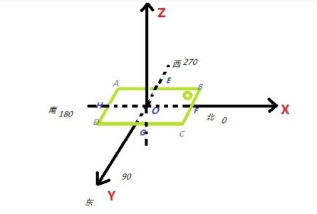

# 15.2Android的常用传感器

Android平台支持三大类的传感器：

* 位移传感器 
这些传感器测量沿三个轴线测量加速度和旋转。这类包含加速度，重力传感器，陀螺仪，和矢量传感器。 

* 环境传感器 
这些传感器测量各种环境参数，例如周围的空气温度和压力，光线，和湿度。这类包含气压，光线，和温度传感器。 

* 位置传感器 
这些传感器测量设备的物理位置。这类包含方向和磁力传感器。 

这些传感器的一些是基于硬件的，一些是基于软件的。基于硬件的传感器是内嵌到手机或者平板中的物理元件，它们通过直接测量指定的环境属性来得到它们的数据，例如加速度，磁场强度，或者角度变化。基于软件的传感器不是物理设备，尽管它们模仿基于硬件的传感器。基于软件的 传感器从一个或更多基于硬件的传感器获取它们的数据，并且有时候被称为虚拟传感器或者合成传感器。线性加速度传感器和重力传感器是基于软件传感器的例子。

* 具体使用传感器时需参考所使用的Android版本的的API。

## 1 方向传感器（*）

方向传感器用于感应手机设备的摆放位置

如上图所示，绿色部分表示一个手机，带有小圈那一头是手机头部

* 传感器中的X:如上图所示，规定X正半轴为北，手机头部指向OF方向，此时X的值为0,如果手机头部指向OG方向，此时X值为90,指向OH方向，X值为180,指向OE，X值为270

* 传感器中的Y：现在我们将手机沿着BC轴慢慢向上抬起，即手机头部不动，尾部慢慢向上翘起来，直到AD跑到BC右边并落在XOY平面上，Y的值将从0~180之间变动，如果手机沿着AD轴慢慢向上抬起，即手机尾部不懂，直到BC跑到AD左边并且落在XOY平面上，Y的值将从0~-180之间变动，这就是方向传感器中Y的含义。

* 传感器中的Z:现在我们将手机沿着AB轴慢慢向上抬起，即手机左边框不动，右边框慢慢向上翘起来，直到CD跑到AB右边并落在XOY平面上，Z的值将从0~90之间变动，如果手机沿着CD轴慢慢向上抬起，即手机右边框不动，直到AB跑到CD左边并且落在XOY平面上，Z的值将从0~-90之间变动，这就是方向传感器中发Z的含义。

## 2 加速度传感器

* 加速度传感器又叫G-sensor，返回x、y、z三轴的加速度数值。

* 返回x、y、z三轴的加速度数值。

* 说明

该数值包含地心引力的影响，单位是m/s^2。

将手机平放在桌面上，x轴默认为0，y轴默认0，z轴默认9.81。
将手机朝下放在桌面上，z轴为-9.81。
将手机向左倾斜，x轴为正值。
将手机向右倾斜，x轴为负值。
将手机向上倾斜，y轴为负值。 
将手机向下倾斜，y轴为正值。

## 3 磁力传感器
磁力传感器简称为M-sensor，返回x、y、z三轴的环境磁场数据。

该数值的单位是微特斯拉（micro-Tesla），用uT表示。

单位也可以是高斯（Gauss），1Tesla=10000Gauss。

硬件上一般没有独立的磁力传感器，磁力数据由电子罗盘传感器提供（E-compass）。

电子罗盘传感器同时提供下文的方向传感器数据。

## 4 陀螺仪传感器

陀螺仪传感器叫做Gyro-sensor，返回x、y、z三轴的角加速度数据。

角加速度的单位是radians/second。

根据Nexus S手机实测：

水平逆时针旋转，Z轴为正。

水平逆时针旋转，z轴为负。

向左旋转，y轴为负。

向右旋转，y轴为正。

向上旋转，x轴为负。

向下旋转，x轴为正。

## 5 光线感应传感器

光线感应传感器检测实时的光线强度，光强单位是lux，其物理意义是照射到单位面积上的光通量。

光线感应传感器主要用于Android系统的LCD自动亮度功能。

可以根据采样到的光强数值实时调整LCD的亮度。

 

## 6 压力传感器

压力传感器返回当前的压强，单位是百帕斯卡hectopascal（hPa）。

 

## 7 温度传感器

温度传感器返回当前的温度。

 

## 8 接近传感器

接近传感器检测物体与手机的距离，单位是厘米。

一些接近传感器只能返回远和近两个状态，

因此，接近传感器将最大距离返回远状态，小于最大距离返回近状态。

接近传感器可用于接听电话时自动关闭LCD屏幕以节省电量。

一些芯片集成了接近传感器和光线传感器两者功能。

## 9 重力传感器

重力传感器简称GV-sensor，输出重力数据。

在地球上，重力数值为9.8，单位是m/s^2。

坐标系统与加速度传感器相同。

当设备复位时，重力传感器的输出与加速度传感器相同。

 

## 10 线性加速度传感器

线性加速度传感器简称LA-sensor。

线性加速度传感器是加速度传感器减去重力影响获取的数据。

单位是m/s^2，坐标系统与加速度传感器相同。

加速度传感器、重力传感器和线性加速度传感器的计算公式如下：

加速度 = 重力 + 线性加速度

 

## 11 旋转矢量传感器

旋转矢量传感器简称RV-sensor。

旋转矢量代表设备的方向，是一个将坐标轴和角度混合计算得到的数据。

RV-sensor输出三个数据：

x*sin(theta/2)

y*sin(theta/2)

z*sin(theta/2)

sin(theta/2)是RV的数量级。

RV的方向与轴旋转的方向相同。

RV的三个数值，与cos(theta/2)组成一个四元组。

RV的数据没有单位，使用的坐标系与加速度相同。

# Android 5.0 新增的心率传感器

心率传感器可以返回佩戴设备的人每分钟的心跳次数。该传感器返回的数据的准确性可以通过SensorEvent的accuracy进行判断，如果该属性值为SENSOR_STATUS_UNRELIABLE或SENSOR_STATUS_NO_CONTACT，则表明传感器返回的心率值是不太可靠的，应该被丢弃。
这种传感器的使用需要有android.permission.BODY_SENSORS权限

