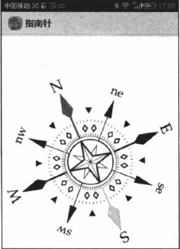
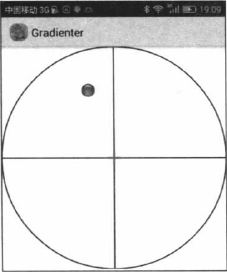


###实例：指南针

开发指南针的思路如下：先准备一张指南针图片，该图片上方向指针指向北方。接下来开发一个检测方向的传感器，程序检测到手机顶部绕Z轴转过多少度，让指南针图片反向转过多少度即可。由此可见，指南针应用只要在界面中添加一张图片，并让图片总是反向转过方向传感器返回的第一个角度即可。下面是该程序的代码：

##### 程序清单：codes\15\15.3\Compass\app\src\main\java\org\crazyit\compass\MainActivity.java
```
public class MainActivity extends Activity
   implements SensorEventListener
{
    //定义显示指南针的图片
    ImageView anaImage;
    //记录指南针图片转过的角度
    float currentDegree=0f;
    //定义Sensor管理器
    SensorManager mSensorManager;

    @Override
    public void onCreate(Bundle savedInstanceState)
    {
        super.onCreate(savedInstanceState);
        setContentView(R.layout.main);
        //获取界面中显示指南针的图片
        znzImage=(ImageView) findViewByID(R.id.znzImage);
        //获取传感器管理服务
        mSensorManager=(SensorManager)getSystemService(SENSOR_SERVICE);
     }

     @Override
     protected void onPause()
    {
        //取消注册
        mSensorManager.unregisterListener(this);
        super.onPause();
     }

     @Override
     protected void onStop()
    {
         //取消注册
         mSensorManager.unregisterListener(this);
         super.onStop();      
     }

     @Override
     public void onSensorChanged(SensorEvent event)
     {
         //获取触发event的传感器类型
         int sensorType=event.sensor.getType();
         switch(sensorType)
         {
            case Sensor.TYPE_ORIENTATION:
                 //获取绕Z轴转过的角度
                 float degeree=event.values(0);
                 //创建旋转动画（反向转过degree度）
#####            RotateAnimation ra=new RotateAnimation(currentDegree,-degree,Animation.RELATIVE_TO_SELF,0.5f,Animtion.RELATIVE_TO_SELF,0.5f);
                 //设置动画的持续时间
                 ra.setDuration(200);
                 //运行动画
                 znzImage.startAnimation(ra);
                 currentDegree=-degree;
                 break;
         } 
     }

     @Override
     public void onAccuracyChanged(Sensor sensor,int accuracy)
     {  
     }
 }
```
指南针程度的关键代码就是程序中的粗体字代码，该程序检测到手机绕Z轴转过的角度，也就是手机Y轴与正北方向的夹角，然后让指南针图片反向转过相应的角度即可。
在真机中调试该程序，运行该程序，即可看到如下图：


###实例：水平仪

* 这里的水平仪，即是传统的水平仪，在一个透明的圆盘中充满某种液体，液体中留有一个气泡，当一端翘起时，该气泡将会浮向翘起的一端。
* 方向传感器会返回三个角度值，其中第二个角度值代表底部翘起的角度（当顶部翘起时为负值）；第三个角度值代表右侧翘起的角度（当左侧翘起时为负值）；根据这两个角度值就可开发出水平仪了。

假设我们以大透明圆盘的中心为圆点，当手机顶部翘起时，气泡应该向顶部移动，也就是气泡位置的Y坐标（2D绘图坐标系，屏幕左上角为原点）应减小；当手机底部翘起时，气泡应该向底部移动，也就是气泡位置的Y坐标应增大——假设气泡开始位于大透明圆盘的中心，气
泡的Y坐标的改变正好与方向传感器返回的第二参数代表的角度的正负相符，因此根据方向传感器返回的第二个参数来计算气泡的Y坐标即可；以此类似，当手机左侧翘起时，气泡应该向左侧移动，也就是气泡位置的X坐标（2D绘图坐标系，屏幕左上角为原点）应减小；当手机
右侧翘起时，气泡应该向右侧移动，也就是气泡位置的X坐标应增大——假设气泡开始位于大透明圆盘的中心，气泡的X坐标的改变正好与方向传感器返回的第三个参数代表的角度的正负相符，因此根据方向传感器返回的第三个参数来计算气泡的X坐标即可。
通过上面介绍的方式来动态改变程序界面中的气泡的位置——手机哪端翘起，水平仪中的气泡就浮向哪端，这就是水平仪的实现思想。
该程序用了一个自定义View，该自定义View很简单，就是绘制透明圆盘和气泡——其中气泡的位置会动态改变。该自定义View的代码如下：

##### 程序清单：codes\15\15.3\Gradienter\app\src\main\java\org\crazyit\sensor\MyView.java
```
public class MyView extends View
{
    //定义水平仪仪表盘图片
    Bitmap back;
    //定义水平仪中的气泡图标
    Bitmap bubble;
    //定义水平仪中气泡的X、Y坐标
    int bubbleX,bubbleY;
    
    public MyView(Context context,AttributeSet attrs)
    {
        super(context,attrs);
        //获取窗口管理器
        WindowManager wm=(WindowManager) context.getSystemService(Context.WINDOW_SERVICE);
        //获取屏幕的宽度和高度
        Display display=wm.getDefaultDisplay();
        DisplayMetrics metrics=new DisplayMetrics();
        display.getMetrics(metrics);
        int screenWidth=metrics.widthPixels;
        //创建位图
        back=Bitmap.createBitmap(screenWidth,screenWideth,Bitmap.Config.ARGB_8888);
        Canvas canvas = new Canvas(back);
        Paint paint = new Paint();
        paint.setAntiAlias(true);

        //设置绘制风格，仅填充
        paint.setStyle(Paint.Style.FILL);
        //创建一个线性渐变来绘制线性渐变
        Shader shader = new LinearGradient(0,screenWidth, screenWidth*0.8f, screenWidth*0.2f, Color.YELLOW, Color.WHITE, Shader.TileMode.MIRROR);
        paint.setShader(shader);
       
        //绘制圆形
        canvas.drawCircle(screenWidth/2, screenWidth/2, screenWidth/2, paint);
        Paint paint2 =new Paint();
        paint2.setAntiAlias(true);

        //设置绘制风格：仅绘制边框
        paint2.setStyle(Paint.Style.STROKE);
        paint2.setStrokeWidth(5);  //设置画笔宽度
        paint2.setColor(Color.BLACK); //设置画笔颜色

        //绘制圆形边框
        canvas,drawCircle(screenWidth/2, screenWidth/2, screenWidth/2, paint2);
        //绘制水平横线
        canvas.drawLine(0,screenWidth/2, screenWidth, screenWidth/2, paint2);
        //绘制垂直横线
        canvas.drawLine(screenWidth/2,0, screenWidth, screenWidth/2, paint2);
        
        paint2.setStrokeWidth(10); //设置画笔宽度
        //设置画笔颜色
        paint2.setColor(Color.RED);
        //绘制中心的红色“十”字
        canvas.drawLine(screenWidth/2-30, screenWidth/2, screenWidth/2+30, screenWidth/2, paint2);
        canvas.drawLine(screenWidth/2, screenWidth/2-30, screenWidth/2, screenWidth/2+30, paint2);
        //加载气泡图片
        bubble=BitmapFactory.decodeResource(getResources(),R.drawable.bubble);
     }
    
     @Override
     protected void onDraw(Canvas canvas)
     {
         super.onDraw(canvas);
         //绘制水平仪仪表盘图片
         canvas.drawBitmap(back,0,0,null);
         //根据气泡坐标绘制气泡
#####    canvas.drawBitmap(bubble,bubbleX,bubbleY,null);
     }
}
```

* 粗体字表示，该自定义View会根据bubbleX、bubbleY动态地绘制气泡的位置，而这个bubbleX、bubbleY就需要根据方向传感器返回的第三个角度、第二个角度来计算。

下面是该程序中Activity的代码。 

##### 程序清单：codes\15\15.3\Gradienter\app\src\main\java\org\crazyit\sensor\MainActivity.java
```
public class MainActivity extends Activity implements SensorEventListener
{
     //定义水平仪的仪表盘
     MyView show;
     //定义水平仪能处理的最大倾斜角，超过该角度，气泡将直接位于边界
     int MAX_ANGLE=30;
     //定义Sensor管理器
     SensorManager mSensorManager;
     
     @Override
     public void onCreate(Bundle savedInstanceState)
     {
         super.onCreate(savedInstanceState);
         setContentView(R.layout.main);
         //获取水平仪的主组件
         show = (MyView) findViewById(R.id.show);
         //获取传感器管理服务
         mSensorManager = (SensorManager) getSystemService(SENSOR_SERVICE);
     }

     @Override
     public void onResume()
     {
         super.onResume();
         //为系统的方向传感器注册监听器
         mSensorManager.registerListener(this,mSensorManager.getDefaultSensor(Sensor.TYPE_ORIENTATION),SensorManager.SENSOR_DELAY_GAME);
     }

     @Override
     protected void onPause()
     {
         //取消注册
        mSensorManager.unregisterListener(this);
        super.onPause(); 
     }
     
     @Override
     protected void onStop()
     {
         //取消注册
        mSensorManager.unregisterListener(this);
        super.onStop(); 
     }

     @Override
     public void onAccuracyChanged(Sensor sensor,int accuracy)
     {  
     }

     @Override
     public void onSensorChanged(SensorEvent event)
     {
          float[] values =event.values;
          //获取触发event的传感器类型
          int sensorType = event.sensor.getType();
          switch(sensorType)
          {
              case Sensor.TYPE_ORIENTATION:
                   //获取与Y轴的夹角
                   float yAngle = values[1];
                   //获取与Z轴的夹角
                   float zAngle = values[2];
                   //气泡位于中间时（水平仪完全水平），气泡X、Y坐标
                   int x = (show.back.getWidth() -show.bubble.getWidth())/2;
                   int y = (show.back.getHeight() -show.bubble.getHeight())/2;
                   //如果与Z轴的倾斜角还在最大角度之内
                   if(Math.abs(zAngle) <= MAX_ANGLE)
                   {
                        //根据与Z轴的倾斜角度计算X坐标的变化值
                        //（倾斜角度越大，X坐标变化越大）
                        int deltaX = (int) ((show.back.getWidth() -show.bubble.getWidth())/2* zAngle/ MAX_ANGLE);
                        x+=deltaX;
                   }
                   //如果与Z轴的倾斜角已经大于MAX_ANGLE,气泡应到最左边
                   else if(zAngle > MAX_ANGLE)
                   {
                       x=0;
                   }
                   //如果与Z轴的倾斜角已经小于负的MAX_ANGELE,气泡应到最右边
                   else
                   {
                       x=show.back.getWidth()-show.bubble.getWidth();
                   }

                   //如果与Y轴的倾斜角还在最大角度之内
                   if(Math.abs(yAngle) <= MAX_ANGLE)
                   {
                         //根据与Y轴的倾斜角度计算Y坐标的变化值
                         // 倾斜角度越大，Y坐标变化越大
                         int deltaY=(int) ((show.back.getHeight() -show.bubble.getHeight())/2* yAngle/ MAX_ANGLE);
                         y+= deltaY;
                   }
                   //如果与Y轴的倾斜角已经大于MAX_ANGLE，气泡应到最下边
                   else if(yAngle > MAX_ANGLE)
                   {
                       y=show.back.getHeight()-show.bubble.getHeight();
                   }
                   //如果与Y轴的倾斜角已经小于负的MAX_ANGLE,气泡应到最右边
                   else
                   {
                         y=0;
                   }
                   //如果计算出的X、Y坐标还位于水平仪的仪表盘内，则更新水平仪的气泡坐标
                   if(isContain(x,y))
                   {
                       show.bubbleX=x;
                       show.bubbleY=y;
                   }
                   //通知系统重绘MyView组件
                   show.postInvalidate();
                   break;
          }
     }

     //计算x、y点的其阿婆是否处于水平仪的仪表盘内
     private boolean isContain(int x,int y)
     {
         //计算气泡的圆心坐标X、Y
         int bubbleCx = x + show.bubble.getWidth()/2;
         int bubbleCy = y + show.bubble.getWidth()/2;
         //计算水平仪仪表盘的圆心坐标X、Y
         int backCx = show.back.getWidth()/2;
         int backCy = show.back.getWidth()/2;
         //计算气泡的圆心与水平仪仪表盘的圆心之间的距离
         double distance = Math.sqrt((bubbleCx - backCx) * (bubbleCx - backCx)+(bubbleCy-backCy) * (bubbleCy - backCy));
         //若两个圆心的距离小于它们的半径差，即可认为处于该点的气泡依然位于仪表盘内
         if(distance < (show.back.getWidth() -show.bubble.getWidth())/2)
         {
               return true;
         }
         else
         {
               return false;
         }
     }
}
```
该程序运行结果如下图。


由上图可看到水平仪中间的气泡，通过该气泡所在的位置即可大致确定手机底下的支撑是否水平。当气泡位于仪表盘中的"+"标识处时，即可认为手机底下的支撑完全水平。

