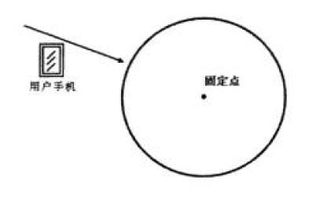
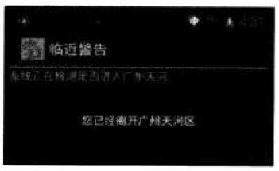

# 16.4临近警告

　　前面介绍LocationManager时已经提到，该API提供了一个`addProximityAlert(double latitude,double longitude,float radius,long expiration,PendingIntent intent)`方法，该方法用于添加一个临近警告。所谓临近警告的示意如图16.4所示。也就是当用户手机不断临近指定固定点时，当与该固定点的距离小于指定范围时，系统可以触发相应的处理。
<center>

图16.4 临近警告的示意</center>

　　添加临近警告的方法的参数的说明如下。

- latitude：指定固定点的经度。
- longitude：指定固定点的纬度。
- radius：该参数指定一个半径长度。
- expiration：该参数指定经过多少毫秒后该临近警告就会过期失效。-1指定永不过期。
- intent：该参数指定临近该固定点时触发该intent对应的组件。

　　下面的程序示范了如何检测手机是否进入了广州天河区，该程序几乎没有界面。当程序启动后，程序就会添加一个临近警告，当用户临近广州市天河区所在经度、纬度时，系统会显示提示。该程序代码如下：
``````java
public class MainActivity extends Activity
{
	@Override
	public void onCreate(Bundle savedInstanceState)
	{
		super.onCreate(savedInstanceState);
		setContentView(R.layout.main);
		// 定位服务的常量
		String locService = Context.LOCATION_SERVICE;
		// 定位服务管理器实例
		LocationManager locationManager;
		// 通过getSystemService方法获得LocationManager实例
		locationManager = (LocationManager) getSystemService(locService);
		// 定义"广州天河"的经度、纬度
		double longitude = 113.39;
		double latitude = 23.13;
		// 定义半径（5公里）
		float radius = 5000;
		// 定义Intent
		Intent intent = new Intent(this, ProximityAlertReciever.class);
		// 将Intent包装成PendingIntent
		PendingIntent pi = PendingIntent.getBroadcast(this, -1, intent, 0);
		// 添加临近警告
		locationManager.addProximityAlert(latitude, longitude, radius, -1, pi);// ①
	}
}
``````
　　上面的程序中①号代码用于添加临近警告，当手机用户临近指定经度、纬度确定的点时，系统会启动pi所对应的组件。pi对应的组件是一个BroadcastReceiver，它的代码如下。
``````java
public class ProximityAlertReciever extends BroadcastReceiver
{
	@Override
	public void onReceive(Context context, Intent intent)
	{
		// 获取是否为进入指定区域
		boolean isEnter = intent.getBooleanExtra(
				LocationManager.KEY_PROXIMITY_ENTERING, false);
		if(isEnter)
		{
			// 显示提示信息
			Toast.makeText(context
					, "您已经进入广州天河区"
					, Toast.LENGTH_LONG)
					.show();
		}
		else
		{
			// 显示提示信息
			Toast.makeText(context
					, "您已经离开广州天河区"
					, Toast.LENGTH_LONG)
					.show();
		}
	}
}
``````
　　该BroadcastReceiver被激发后的处理非常简单，程序通过Intent传递过来的消息判断设备是进入指定区域还是离开指定区域，并根据不同的状态提示不同的信息。运行该程序，并通过DDMS的Emulator Control面板输入广州天河的经度、纬度（113.39、23.13），即可看到如图16.5所示的提示。如果接下来在DDMS的Emulator Control面板输入其它的经度、纬度，就意味着该设备离开了该区域，于是可以看到如图16.6所示的提示。
<center>


16.5 进入区域的提示



16.6 离开区域的提示
</center>
# 16.5 本章小结
　　本章主要介绍了Android提供的GPS支持，目前的绝大部分Android手机都提供了GPS硬件支持，都可以作为GPS定位系统的接收机，而开发者要做的就是从Android系统中获取GPS定位信息。学习本章的重点是掌握LocationManager、LocationProvider与LocationListener等API的功能和用法，并可以通过它们来监听、获取GPS定位信息。一旦在应用程序中获取了GPS定位信息之后，接下来就可以通过这种定位信息在Google Map上进行定位、跟踪等。