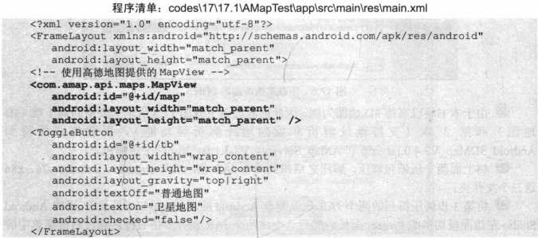

##   　　17.2根据GPS信息在地图上定位

　　通过ＭapView获取AMap对象之后，接下来即可通过Amap来控制地图的显示形式和显示外观了。AMap提供了如下常用方法来控制地图。

* setLocationSource(LocationSource locationSource):设置定位数据源。

* setＭapType(int type):设置地图显示的类型。

* setMyLocationEnabled(boolean paramBoolean):设置定位层是否显示。

* setMyLocationRotateAngle(float rotate):设置定位图片旋转的角度，从正北向开始，逆时针计算。

* setMyLocationStyle(MyLocationStyle style):设置定位（当前位置）的绘制样式。

* setMyLocationType(int type):设置定位的类型。该方法支持三个参数值，分别为LOCATION_TYPE_LOCATE,表示只在第一次定位时移动到地图的中心点；LOCATION_TYPE_MAP_FOLLOW,表示总是定位、移动到地图的中心点；LOCATION_TYPE_MAP_ROTATE,表示总是定位、移动到地图的中心点,跟踪并根据方向旋转地图。

* setPointToCenter(int x,int y):设置屏幕上的某个点为地图的中心点。

* setTrafficEnabled(boolean enabled):设置是否显示交通状况。 
　　

　　除此之外，AMap还提供了大量的setOnXxxListener()方法，这些方法都需要传入相应的监听器实现类，通过这些监听器可以让地图相应用户操作。

　　如果用户希望像地图上添加自定义的图片或形状，AMap提供了如下常用方法。

* addArc(ArcOptions options):在地图上添加一段扇形覆盖物（Arc）。

* addCircle(CircleOptions options):在地图上添加圆形（Circle）覆盖物。
 
* addGroundOverlay(GroundOverlayOptions options):在地图上添加图片。
 
* addMarker(MarkerOptions options):在地图上添加标记（Marker）。

* addMarkers(java.util.AyyayList<MarkerOptions> list, boolean moveToCenter):在地图上添加多个标记，并设置是否移动到屏幕中间。

* Polygon addPolygon(PolygonOptions options):在地图上添加一个多边形（Polygon）。

* Polyline addPolyline(PolylineOptions options):在地图上添加多条线段（Polyline）。

* addTileOverlay(TitleOverlayOptions options):在地图上添加tile overlay 图层。

　　不管程序需要向地图添加哪种东西，程序的操作步骤都大致相同，可都按如下步骤进行。

　　①创建一个XxxOptions，比如要添加Marker对象，程序就需要先创建一个MarkerOptions：比如添加Polyline，就需要创建PolylineOptions。

　　②调用XxxOptions的各种setter方法来设置属性。

　　③调用AMap对象的addXxx（）方法添加即可。

 
　　**提示：**

　　 *高德地图上的API文档本来就是用中文写成的，因此读者可以直接通过高德官网来了解AMap的各种方法的功能和用法。*

　　为了表示Ｍap上的指定点，高德地图提供了LatLng类，LatLng十分简单，它就是对纬度、经度的封装。除此之外，高德地图还提供了一个CameraUpdate类（该类并未提供构造器，程序应该提通过CameraUpdateFactory来创建该类的实例），CameraUpdate可控制地图的缩放级别、定位、倾斜角度等信息，程序调用AMap的moveCamera(CameraUpdate update)方法根据CameraUpdate对地图进行缩放、定位和倾斜。

　　掌握了高德地图的上面常用的API之后，接下来就可以开发Android的Map应用了。

　　下面的程序示范了如何根据经度、纬度在地图上进行定位。该程序的界面提供了文本框让用户输入经度、纬度，也允许用户设置通过GPS信号在地图上定位。该程序的界面布局代码如下。

　　程序清单：codes\17\17.2\LocationMap\app\src\main\res\layout\main.xml

    <?xml version="1.0" encoding="utf-8"?>
    <LinearLayout
	xmlns:android="http://schemas.android.com/apk/res/android"
	android:orientation="vertical"
	android:layout_width="match_parent"
	android:layout_height="match_parent">
    <LinearLayout
	android:orientation="horizontal"
	android:layout_width="match_parent"
	android:layout_height="wrap_content"
	android:gravity="center_horizontal">
	<TextView
		android:text="@string/txtLong"
		android:layout_width="wrap_content"
		android:layout_height="wrap_content"/>
	<!-- 定义输入经度值的文本框 -->
	<EditText
		android:id="@+id/lng"
		android:text="@string/lng"
		android:inputType="numberDecimal"
		android:layout_width="100dp"
		android:layout_height="wrap_content" />
	<TextView
		android:text="@string/txtLat"
		android:layout_width="wrap_content"
		android:layout_height="wrap_content"
		android:paddingLeft="8dp" />
	<!-- 定义输入纬度值的文本框 -->
	<EditText
		android:id="@+id/lat"
		android:text="@string/lat"
		android:inputType="numberDecimal"
		android:layout_width="100dp"
		android:layout_height="wrap_content" />
	<Button
		android:id="@+id/loc"
		android:text="@string/loc"
		android:layout_width="match_parent"
		android:layout_height="wrap_content"
		android:layout_weight="4" />
    </LinearLayout>
    <LinearLayout
	android:orientation="horizontal"
	android:layout_width="match_parent"
	android:layout_height="wrap_content"
	android:gravity="center_horizontal">
	<!-- 定义选择定位方式的单选按钮组 -->
    <RadioGroup
	android:id="@+id/rg"
	android:orientation="horizontal"
	android:layout_width="match_parent"
	android:layout_height="match_parent"
	android:layout_weight="1">
	<RadioButton
		android:text="@string/manul"
		android:id="@+id/manual"
		android:checked="true"
		android:layout_width="wrap_content"
		android:layout_height="wrap_content"/>
	<RadioButton
		android:text="@string/gps"
		android:id="@+id/gps"
		android:layout_width="wrap_content"
		android:layout_height="wrap_content"/>
    </RadioGroup>
    </LinearLayout>
    <!-- 使用高德地图的提供的MapView -->
    <com.amap.api.maps.MapView
	android:id="@+id/map"
	android:layout_width="match_parent"
	android:layout_height="match_parent" />
    </LinearLayout>
提供了上面介绍的布局之后，接下来就可以在程序中根据用户输入的经度、纬度来进行定位，也可根据GPS传入的信号进行定位。根据经度、纬度在AMap上定位的步骤如下。

　　根据程序获取的经度、纬度值创建LatLng对象。

　　调用ＣameraUpdateFactory的changeLatLng()方法创建改变地图中心的Camera对象。

　　调用AMap的moveCamera(CameraUpdate update)即可控制地图定位到指定的位置。

　　该实例程序的代码如下。

　　程序清单：codes\17\17.2\LocationMap\app\src\main\java\org\crazyit\map\MainActivity.java

    public class MainActivity extends Activity {
	private MapView mapView;
	private AMap aMap;
	private LocationManager locationManager;
	@Override
	protected void onCreate(Bundle savedInstanceState) {
		super.onCreate(savedInstanceState);
		setContentView(R.layout.main);
		locationManager = (LocationManager) getSystemService(Context
				.LOCATION_SERVICE);
		mapView = (MapView) findViewById(R.id.map);
		// 必须回调MapView的onCreate()方法
		mapView.onCreate(savedInstanceState);
		init();
		RadioButton rb = (RadioButton) findViewById(R.id.gps);
		// 为GPS单选按钮设置监听器
		rb.setOnCheckedChangeListener(new OnCheckedChangeListener()
		{
			@Override
			public void onCheckedChanged(CompoundButton buttonView
					, boolean isChecked)
			{
				// 如果该单选框已经被勾选
				if(isChecked)
				{
					// 通过监听器监听GPS提供的定位信息的改变
					locationManager.requestLocationUpdates(
							LocationManager.GPS_PROVIDER,
							300, 8 , new LocationListener()
							{
								@Override
								public void onLocationChanged(Location loc)
								{
									// 使用GPS提供的定位信息来更新位置
									updatePosition(loc);
								}
								@Override
								public void onStatusChanged(String provider
										, int status, Bundle extras){}
								@Override
								public void onProviderEnabled(String provider)
								{
									// 使用GPS提供的定位信息来更新位置
									updatePosition(locationManager
											.getLastKnownLocation(provider));
								}
								@Override
								public void onProviderDisabled(String provider){}
							});
				}
			}
		});
		Button bn = (Button) findViewById(R.id.loc);
		final TextView latTv = (TextView) findViewById(R.id.lat);
		final TextView lngTv = (TextView) findViewById(R.id.lng);
		bn.setOnClickListener(new View.OnClickListener()
		{
			@Override
			public void onClick(View v)
			{
				// 获取用户输入的经度、纬度值
				String lng = lngTv.getEditableText().toString().trim();
				String lat = latTv.getEditableText().toString().trim();
				if (lng.equals("") || lat.equals(""))
				{
					Toast.makeText(MainActivity.this, "请输入有效的经度、纬度!",
							Toast.LENGTH_SHORT).show();
				}
				else
				{
					// 设置根据用户输入的地址定位
					((RadioButton)findViewById(R.id.manual)).setChecked(true);
					double dLng = Double.parseDouble(lng);
					double dLat = Double.parseDouble(lat);
					// 将用户输入的经、纬度封装成LatLng
					LatLng pos = new LatLng(dLat, dLng);  // ①
					// 创建一个设置经纬度的CameraUpdate
					CameraUpdate cu = CameraUpdateFactory.changeLatLng(pos);  // ②
					// 更新地图的显示区域
					aMap.moveCamera(cu);  // ③
					// 创建MarkerOptions对象
					MarkerOptions markerOptions = new MarkerOptions();
					// 设置MarkerOptions的添加位置
					markerOptions.position(pos);
					// 设置MarkerOptions的标题
					markerOptions.title("疯狂软件教育中心");
					// 设置MarkerOptions的摘录信息
					markerOptions.snippet("专业的Java、iOS培训中心");
					// 设置MarkerOptions的图标
					markerOptions.icon(BitmapDescriptorFactory
							.defaultMarker(BitmapDescriptorFactory.HUE_RED));
					markerOptions.draggable(true);
					// 添加MarkerOptions（实际上就是添加Marker）
					Marker marker = aMap.addMarker(markerOptions);
					marker.showInfoWindow(); // 设置默认显示信息窗
					// 创建MarkerOptions、并设置它的各种属性
					MarkerOptions markerOptions1 = new MarkerOptions();
					markerOptions1.position(new LatLng(dLat + 0.001, dLng))
							// 设置标题
							.title("疯狂软件教育中心学生食堂")
							.icon(BitmapDescriptorFactory
									.defaultMarker(BitmapDescriptorFactory.HUE_MAGENTA))
							.draggable(true);
					// 使用集合封装多个图标，这样可为MarkerOptions设置多个图标
					ArrayList<BitmapDescriptor> giflist = new ArrayList<>();
					giflist.add(BitmapDescriptorFactory
							.defaultMarker(BitmapDescriptorFactory.HUE_BLUE));
					giflist.add(BitmapDescriptorFactory
							.defaultMarker(BitmapDescriptorFactory.HUE_GREEN));
					giflist.add(BitmapDescriptorFactory
							.defaultMarker(BitmapDescriptorFactory.HUE_YELLOW));
					// 在创建一个MarkerOptions、并设置它的各种属性
					MarkerOptions markerOptions2 = new MarkerOptions()
							.position(new LatLng(dLat - 0.001, dLng))
									// 为MarkerOptions设置多个图标
							.icons(giflist)
							.title("疯狂软件教育中心学生宿舍")
							.draggable(true)
									// 设置图标的切换频率
							.period(10);
					// 使用ArrayList封装多个MarkerOptions，即可一次添加多个Marker
					ArrayList<MarkerOptions> optionList = new ArrayList<>();
					optionList.add(markerOptions1);
					optionList.add(markerOptions2);
					// 批量添加多个Marker
					aMap.addMarkers(optionList, true);
				}
			}
		});
	}
	private void updatePosition(Location location)
	{
		LatLng pos = new LatLng(location.getLatitude(), location.getLongitude());
		// 创建一个设置经纬度的CameraUpdate
		CameraUpdate cu = CameraUpdateFactory.changeLatLng(pos);
		// 更新地图的显示区域
		aMap.moveCamera(cu);
		// 清除所有Marker等覆盖物
		aMap.clear();
		// 创建一个MarkerOptions对象
		MarkerOptions markerOptions = new MarkerOptions();
		markerOptions.position(pos);
		// 设置MarkerOptions使用自定义图标
		markerOptions.icon(BitmapDescriptorFactory.fromResource(R.drawable.car));
		markerOptions.draggable(true);
		// 添加MarkerOptions（实际上是添加Marker）
		Marker marker = aMap.addMarker(markerOptions);
	}
	// 初始化AMap对象
	private void init() {
		if (aMap == null) {
			aMap = mapView.getMap();
			// 创建一个设置放大级别的CameraUpdate
			CameraUpdate cu = CameraUpdateFactory.zoomTo(15);
			// 设置地图的默认放大级别
			aMap.moveCamera(cu);
			// 创建一个更改地图倾斜度的CameraUpdate
			CameraUpdate tiltUpdate = CameraUpdateFactory.changeTilt(30);
			// 改变地图的倾斜度
			aMap.moveCamera(tiltUpdate);
		}
	}
	@Override
	protected void onResume() {
		super.onResume();
		// 必须回调MapView的onResume()方法
		mapView.onResume();
	}
	@Override
	protected void onPause() {
		super.onPause();
		// 必须回调MapView的onPause()方法
		mapView.onPause();
	}
	@Override
	protected void onSaveInstanceState(Bundle outState) {
		super.onSaveInstanceState(outState);
		// 必须回调MapView的onSaveInstanceState()方法
		mapView.onSaveInstanceState(outState);
	}
	@Override
	protected void onDestroy() {
		super.onDestroy();
		// 必须回调MapView的onDestroy()方法
		mapView.onDestroy();
	}
    }
上面程序中①、②、③号粗体字代码分别用于创建LatLng对象，并根据LatLng对象创建改变地图中心点的CameraUpdate对象，将地图定位到指定位置点。

　　程序中的第二段粗体字代码示范了如何向地图上添加MarkerOptions--实际上是向地图上添加一个Marker.

　　运行上面的程序，将会看到如图17.7所示的结果。

　　如果读者开发该程序时一切正常，将可以看到如图17.7所示的地图，在应用界面上方的文本框中输入合适的经度、纬度，地图将会定位到指定的位置。

　　图17.7所示的地图界面上有3个Marker,其中最下面一个Marker会不停的闪烁，这是因为程序
给最下面一个Marker设置了３个不同颜色的图标。

　　如果用户选中界面上的“GPS定位”单选钮，程序将会使用LocationManager不断获取GPS信号，并根据GPS信号来调整地图中心，而且程序还在地图定位点添加了一个汽车图标。运行程序可看到如图17.8所示的界面。
　　
