# 建立、配置和使用Activity

* Activity是Android应用中最重要、最常见的应用组件。实际应用中，包含多个Activity，实现不同的Activity向用户呈现不同的操作界面。Android应用的多个Activity组成Activity栈，当前活动的Activity位于栈顶。

* Activity的作用：
  1. 用户与应用程序交互的接口；
  2. 作为放置控件的容器。

* 在Activity中添加的控件，程序中通过findViewById(int id)方法，来获取所添加的控件，不过这些组件都要有一个ID。

* 接下来详细介绍Activity开发、配置和使用。

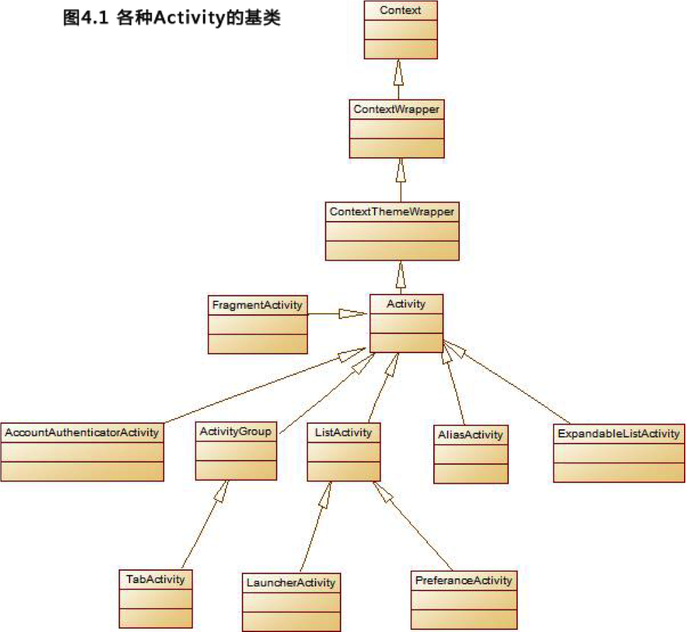

* ## **1.1 建立Activity**
    建立一个Activity的步骤如下：
    1. 建立Activity需要继承Activity基类，根据不同的需要，有时也需要继承Activity的子类；
    2. 需要复写onCreate()方法(由应用程序的框架调用)；
    3. 每一个Activity必须在AndroidManifest.XML文件中进行配置;
    4. 为Activity添加必要的控件。
    
    
    * **例：LaucherActivity的使用（codes\04\4.1\OtherActivity）** 
    
    XML文件代码：
    
    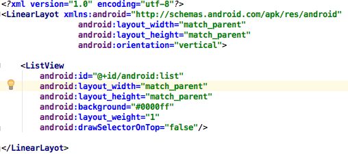
    
    
    LaunchActivity的一个子类代码：
    
    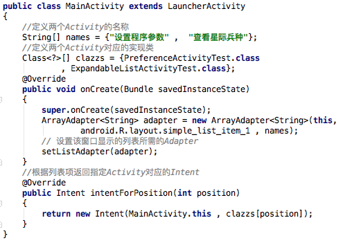
    
    * 上面的程序中用到了两个Activity。
      1. ExpandableListActivityTest：它是ExpandableListActivity的子类，用于显示一个可展开的列表窗口。
      2. PreferenceActivityTest：它是PreferenceActivity的子类，用于显示一个显示设置选项参数并进行保存的窗口。
    
    * 先看ExpandableListActivityTest，它继承了ExpandableListActivity基类，其使用主要是为该Activity传入一个ExpandableListAdapter对象，ExpandableListActivity将会生成一个显示可展开的列表的窗口。
    
    * 接下来看一下ExpandableListActivityTest的代码:
    
    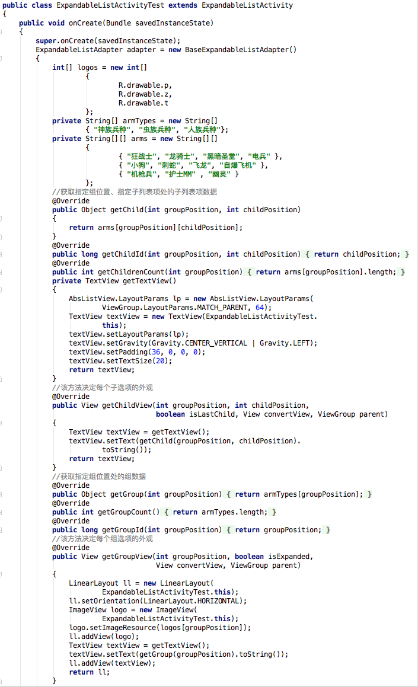
    
    
    * 如果我们要建立一个Activity专门用于设置选项参数，可使用便捷的基类：PreferenceActivity。一旦Activity继承了PreferenceActivity，那么该Activity完全不需要自己控制Preferences的读写， PreferenceActivity为我们做好这一切。
    
    * 使用PreferenceActivity与众不同的一点是，它的界面布局不再使用普通的XxxLayout作为根元素，而是使用PreferenceScreen作为根元素，它表明定义一个参数设置的界面布局。

    * 本例中PreferenceActivity加载的选项设置列表的布局文件如下：
    
    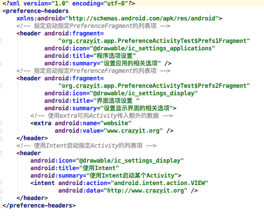
    * 上面的布局文件中指定使用Prefs1Fragment、Prefs2Fragment两个内部类，需要在PreferenceActivityTest类中定义者两个内部类。下面为PreferenceActivityTest的代码：
    
    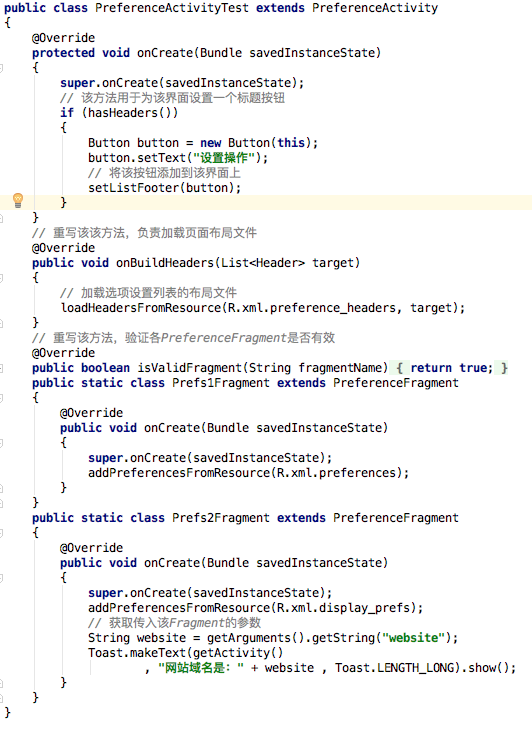
    
    * 上面的Activity中定义了两个PreferenceFragment，需要分别加载preferences.xml、display_prefs两个选项设置的布局文件。
    
    * 建立选项设置的布局文件按如下步骤进行：
      1. 右击Android Studio项目管理面板上的app节点，然后在弹出的右键菜单中单机“New”->“Android resources file”菜单；
      2. 选择创建“XML”，并输入根元素为PreferenceScreen，单机“OK”完成创建。
 
     
    * preferences界面布局文件代码如下：  
    
    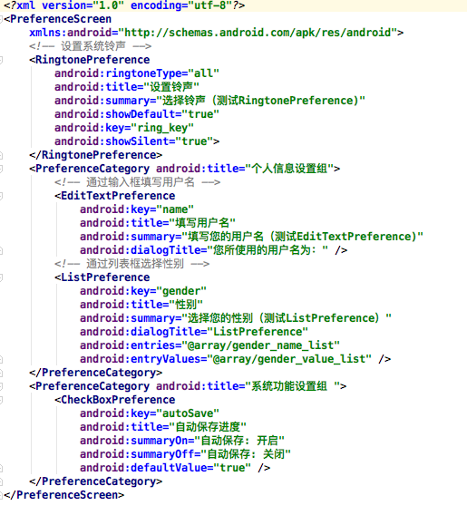
    
    * 在定义了参数设置界面布局文件之后，接下来在Activity程序中使用该界面布局文件进行参数设置、保存，步骤如下：
        1. 让Activity继承PreferenceActivity；
        2. 在onCreate(Bundle savedInstanceState)方法中调用addPreferencesFromResource(…)方法加载指定的界面布局文件。
    
    * 本例还用到了选项设置布局文件display_prefs，代码如下：
    
    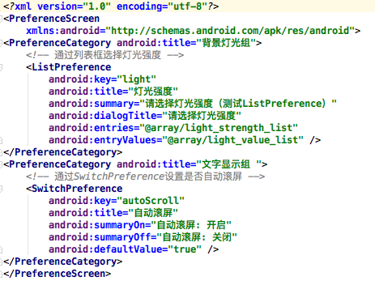
     
* ## **1.2 配置Activity**
    * Android应用要求所有应用程序组件都必须显示进行配置。
    
    * 为了在AndroidManifest.xml文件中配置、管理Activity,只要为<application…/>元素添加<activity…/>子元素即可配置Activity。
    
    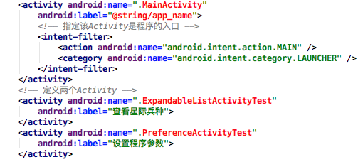
    
    
* ## **1.3 启动、关闭Activity**
    * 一个Android应用通常都会包括多个Activity，但只有一个Activity会作为程序的入口，该Activity会在Android应用运行时，自动启动并执行。至于应用中的其他的Activity，通常由入口Activity启动。

    * Activity启动其他Activity有如下两种方法。
      1. startActivity(Intent  intent)：启动其他的Activity；
      2. startActivityForResult(Intent intent,int requestCode )：以指定请求码(requestCode)启动Activity，而且程序将会等到新启动Activity的结果(通过重写onActivityResult(…)方法来获取)。
      
    * Android为关闭Activity准备了如下两个方法。
      1. finish():结束当前Activity
      2. finishActivity(int requestCode):结束以startActivityForResult(Intent intent,int requestCode )方法启动的Activity

    * **例：两个Activity之间的切换（codes\04\4.1\StartActivity)**
    
     第一个Activity：
     XML文件代码：
     
     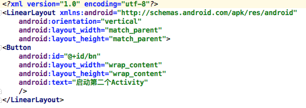
     Java代码：
     
     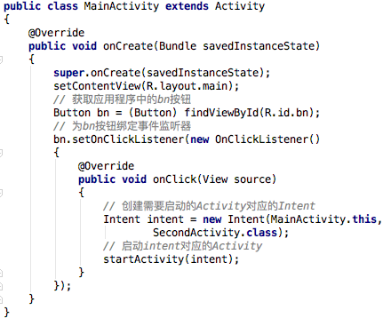
     
     第二个Activity：
     XML文件代码：
     
     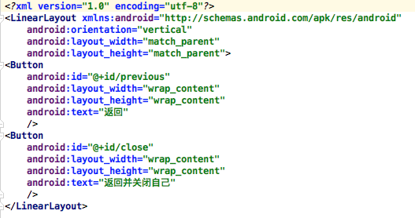
     
     Java代码：
     
     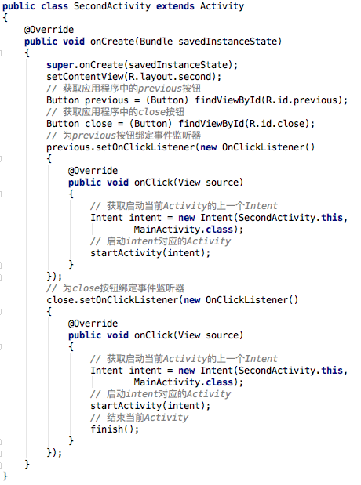
     
     运行界面：
     
     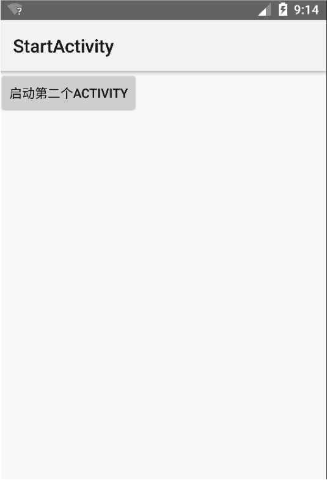
     
     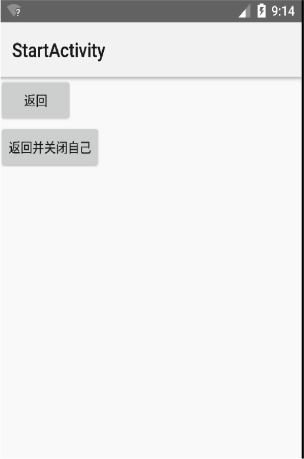
     
     
* ## **1.4 使用Bundle在Activity之间交换数据**
    * 当一个Activity启动另一个Activity时，常常会有一些数据要传递过去，在Android中，需要传递的数据放在对象Intent中
    
    * Intent提供了多个重载的方法来携带额外的数据
      1. putExtras(Bundle data)：向Intent中放入需要携带的数据
      
    * 方法中的Bundle是数据携带包，提供了多个方法存入数据
      1. putXxx(String key,Xxx data)：向Bundle中放入各种类型数据
      2. putSerializable(String key,Serializable data):向Bundle中放入一个可序列化的对象
    
    * 为了取出Bundle数据携带包里的数据，Bundle提供如下方法
      1. getXxx(String key):从Bundle取出Int、Long等各数据类型数据
      2. getSerializable(String key,Serializable data):从Bundle取出一个可序列化的对象
     
    * **例：用第二个Activity处理注册信息（codes\04\4.1\BundleTest）**
    
      第一个Activity：
      XML文件代码：
      
      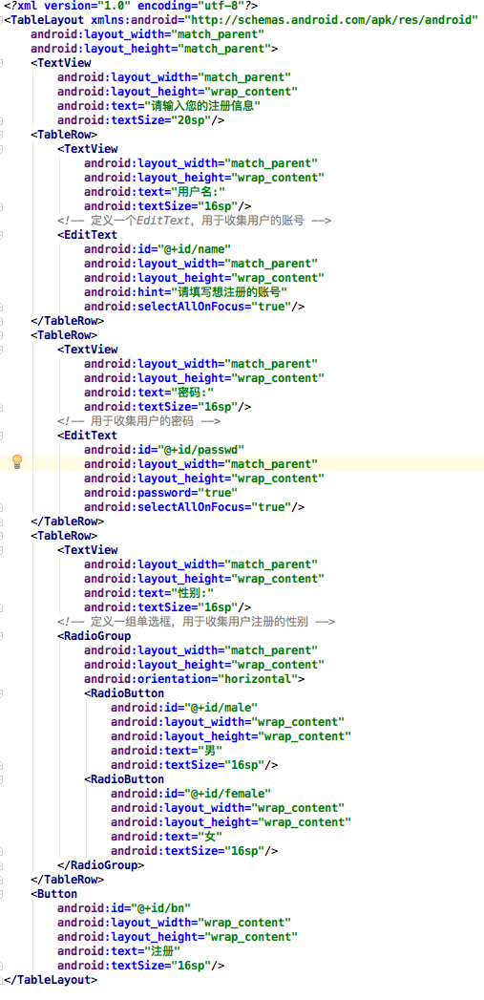
      
      Java代码：
      
      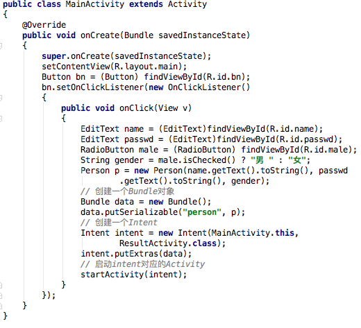
      * 上列代码中创建了一个Person对象，Person类只是一个简单的DTO对象，该类实现了java.io.Serialization接口。
      * 上面的程序创建了一个Bundle对象，并调用putSerialization("person",p)将Person对象放入该Bundle中，然后再使用Intent来“携带”这个Bundle，即可将Person对象传入第二个Activity。
      
      ResultActivity：
      XML文件代码：
      
      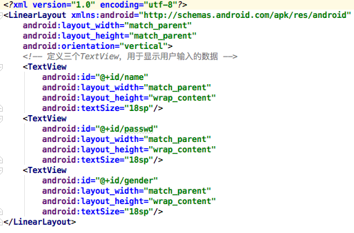
      
      Java代码：
      
      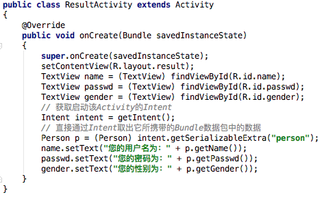
      
      * 第一个Activity的显示界面如下：
      
      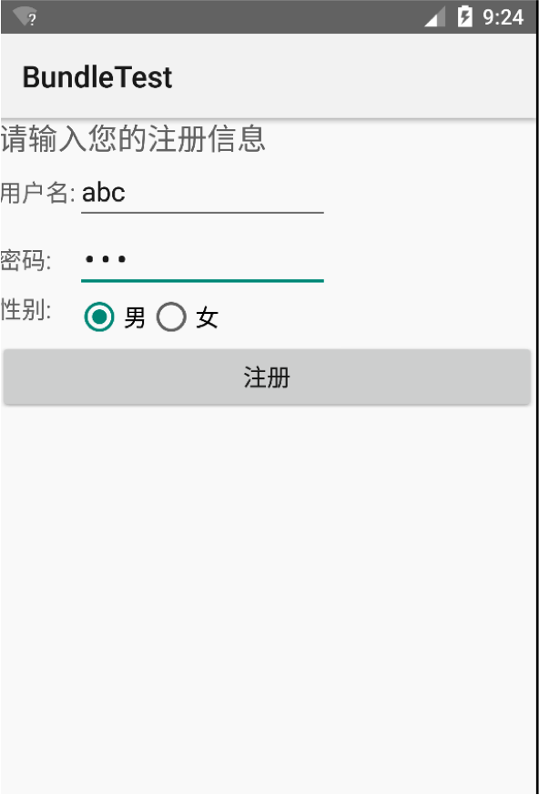
      
      * 单击“注册”按钮后，将会启动ResultActivity，并将用户的数据传入该Activity。显示界面如下：
      
      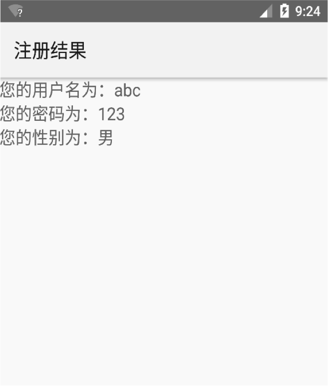
      
      
* ## **1.5 启动其他Activity并返回结果**
    * Activity提供了一个startActivityForResult(Intent intent,int requestCode )方法来启动其他Activity。该方法用于启动指定的Activity，而且期望获取指定Activity返回的结果。

    * 为了获取被启动的Activity所返回的结果，当前Activity需要重写onActivityResult(int requestCode,int resultCode,Intent intent)。

    * 一个Activity中可能包含多个按钮，并调用startActivityForResult()方法来打开多个不同的Activity处理不同的业务。当这些新Activity关闭时，系统都会调用前面Activity的onActivityResult(int requestCode,int resultCode,Intent intent)方法，利用request Code区分是哪个请求结果触发的，利用resultCode区分返回的数据来自哪个新的Activity。

    * **例：用第二个Activity让用户选择信息（codes\04\4.1\ActivityForResult）**

    第一个Activity：
    XML文件代码：
    
    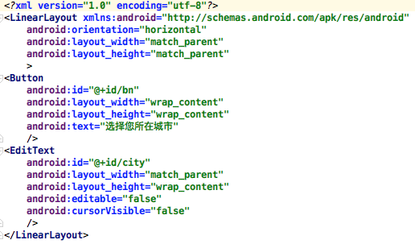
    
    Java代码: 
    
    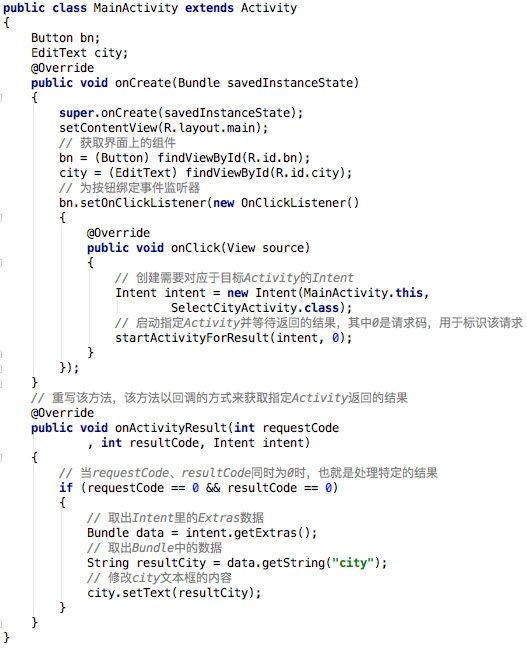
    
    SelectCityActivity：
    Java代码：
    
    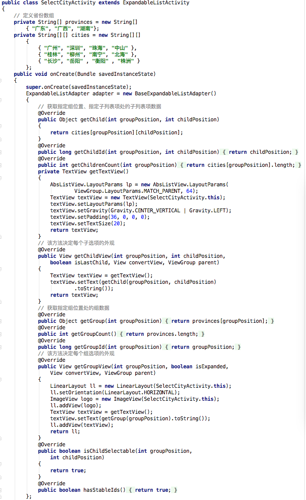
    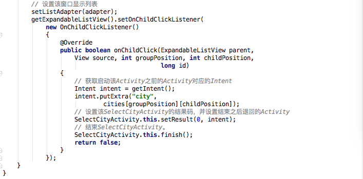
    
    第一个Activity运行后的界面如下：
    
    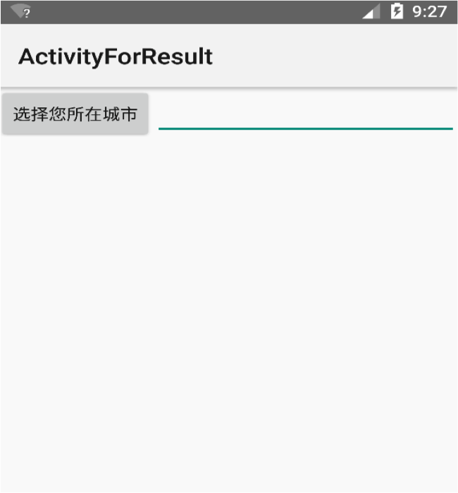
    
    单击“选择您所在城市”按钮后，系统会启动SelectCityActivity，该活动会显示一个可展开的列表；当Activity获取SelectCityActivity选择城市后，将会把该结果显示在上图所示界面右边的文本框中。

    
    
    

    
